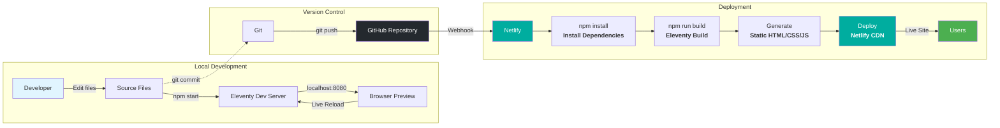
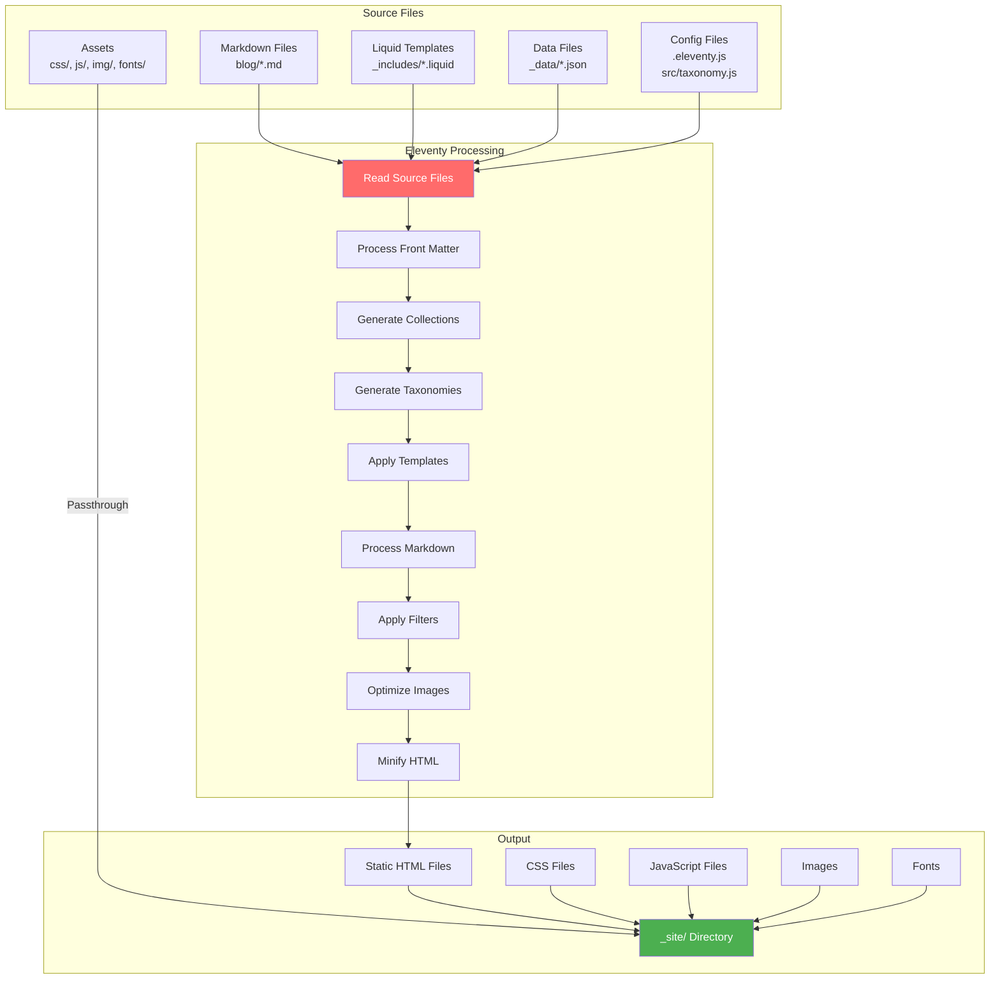
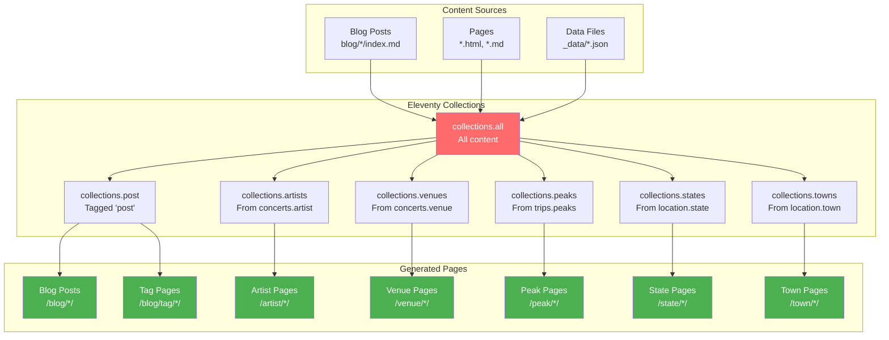
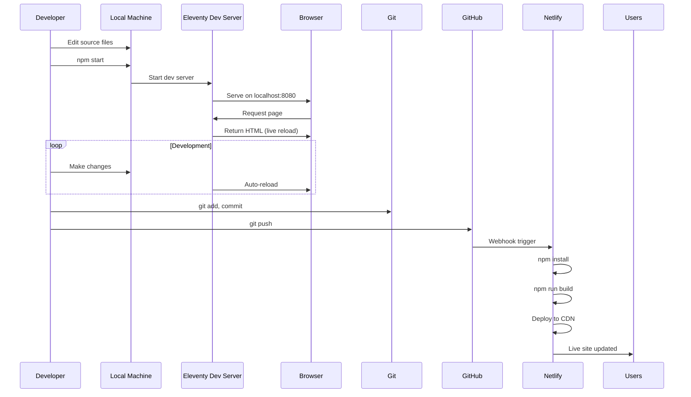
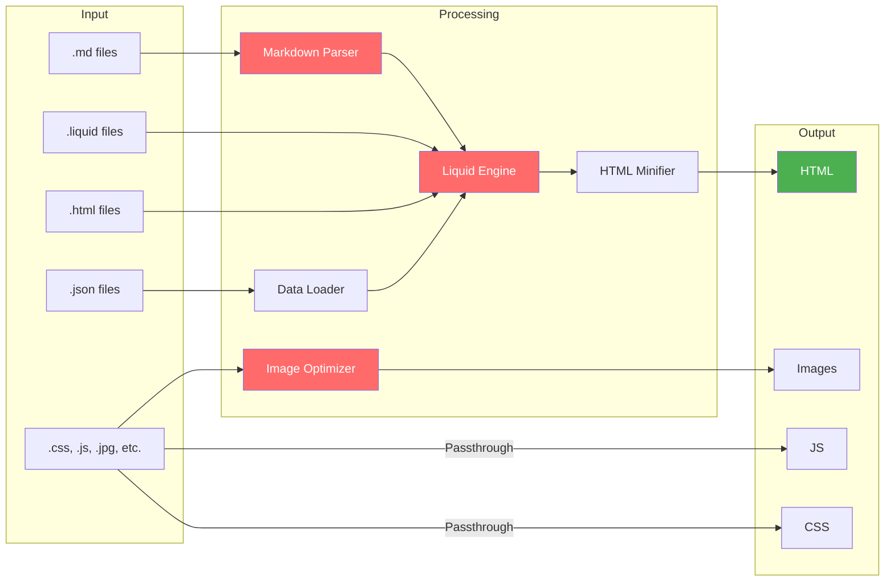
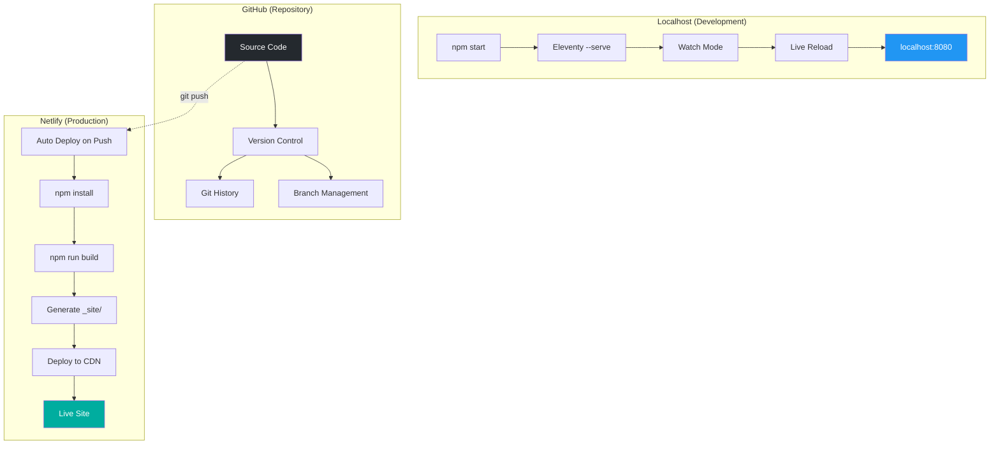

# Site Architecture & Workflow Diagrams

This document uses Mermaid.js diagrams to visualize how the site works, from local development to deployment.

> **Note:** These diagrams render automatically in GitHub, VS Code (with Mermaid extension), and many Markdown viewers. For other tools, use [Mermaid Live Editor](https://mermaid.live/).

---

## 1. Overall Deployment Flow

This diagram shows the complete flow from local development to production deployment.



---

## 2. Eleventy Build Process

This diagram details how Eleventy transforms source files into a static site.



---

## 3. Site Structure & Collections

This diagram shows how content is organized and how collections are generated.



---

## 4. Development Workflow

This diagram shows the typical development cycle.



---

## 5. File Processing Pipeline

This diagram shows how different file types are processed.



---

## 6. Taxonomy Generation Flow

This diagram shows how taxonomies (artists, venues, peaks, etc.) are generated from content.

```mermaid
flowchart TD
    A[Blog Posts with Front Matter] --> B[Eleventy Reads All Content]
    
    B --> C{Extract Taxonomy Data}
    
    C -->|concerts.artist| D[collections.artists]
    C -->|concerts.venue| E[collections.venues]
    C -->|trips.peaks| F[collections.peaks]
    C -->|location.state| G[collections.states]
    C -->|location.town| H[collections.towns]
    C -->|tags| I[collections.{tag}]
    
    D --> J[src/artist.liquid]
    E --> K[src/venue.liquid]
    F --> L[src/peak.liquid]
    G --> M[src/state.liquid]
    H --> N[src/town.liquid]
    I --> O[blog/tags.html]
    
    J --> P[/artist/*/ pages]
    K --> Q[/venue/*/ pages]
    L --> R[/peak/*/ pages]
    M --> S[/state/*/ pages]
    N --> T[/town/*/ pages]
    O --> U[/blog/tag/*/ pages]
    
    style C fill:#ff6b6b,color:#fff
    style P fill:#4caf50,color:#fff
    style Q fill:#4caf50,color:#fff
    style R fill:#4caf50,color:#fff
    style S fill:#4caf50,color:#fff
    style T fill:#4caf50,color:#fff
    style U fill:#4caf50,color:#fff
```

---

## 7. Environment Comparison

This diagram compares the three environments: localhost, GitHub, and Netlify.



---

## Key Concepts

### Build Command
- **Local:** `npm start` → `npx eleventy --serve` (development server with watch mode)
- **Production:** `npm run build` → `NODE_ENV=production eleventy` (static site generation)

### Output Directory
- All generated files go to `_site/` directory
- This directory is what gets deployed to Netlify

### Collections
- Collections are dynamically generated from content
- Taxonomies (artists, venues, peaks, etc.) are created by scanning all content
- Each collection generates multiple pages via pagination templates

### Deployment
- GitHub stores the source code
- Netlify watches for pushes and automatically rebuilds
- Netlify serves the static `_site/` directory via CDN

---

## Viewing These Diagrams

- **GitHub:** Renders automatically in Markdown files
- **VS Code:** Install the "Markdown Preview Mermaid Support" extension
- **Online:** Copy diagram code to [Mermaid Live Editor](https://mermaid.live/)
- **Documentation Sites:** Most modern documentation platforms support Mermaid

---

## Related Documentation

- [Taxonomy Map](TAXONOMY-MAP.md) - Detailed breakdown of all site taxonomies
- [Third-Party Libraries](THIRD-PARTY-LIBRARIES.md) - Complete list of dependencies and external libraries
- [README](README.md) - Project overview

