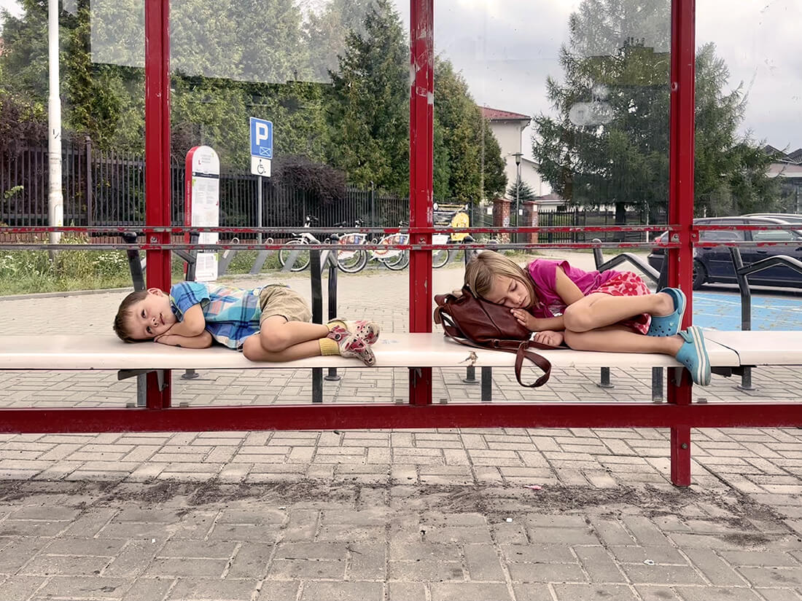
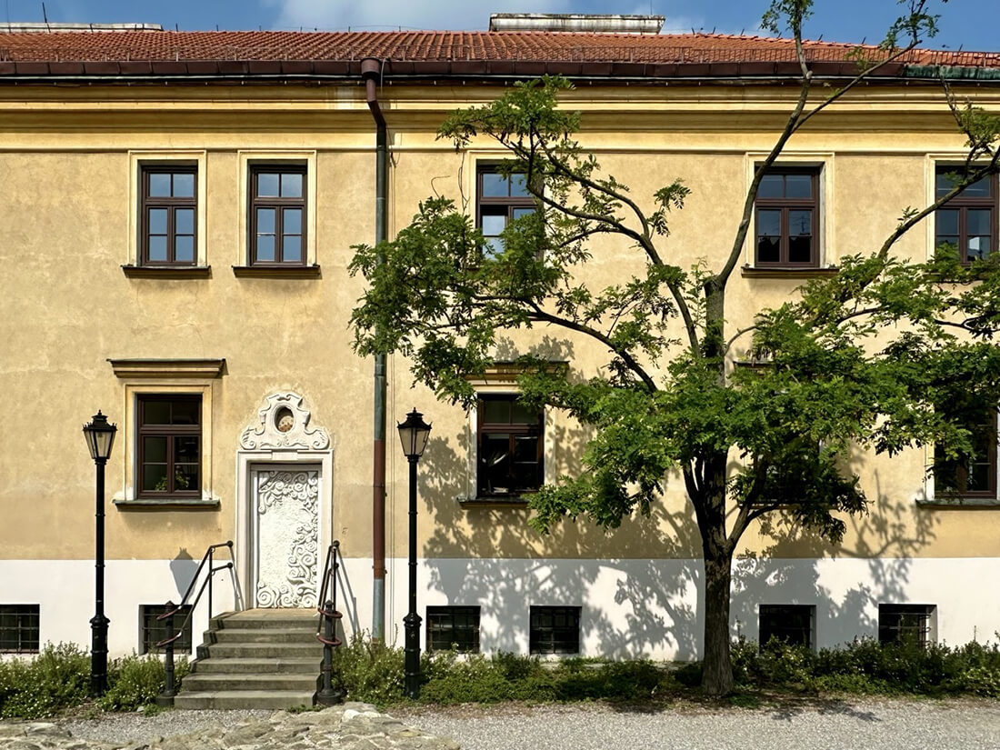
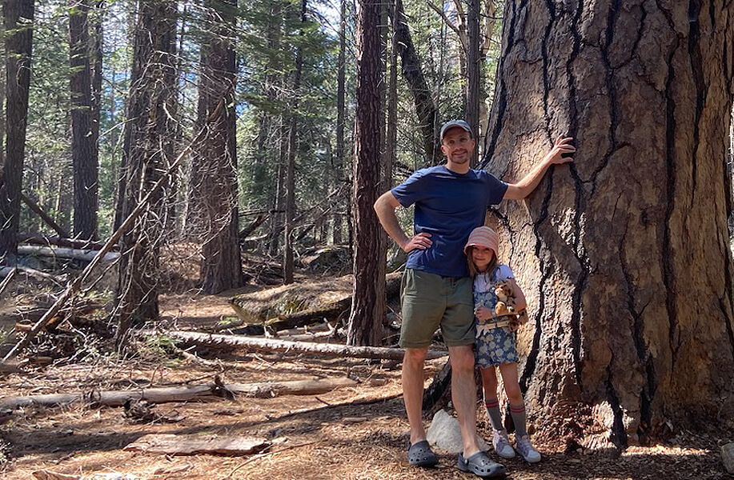
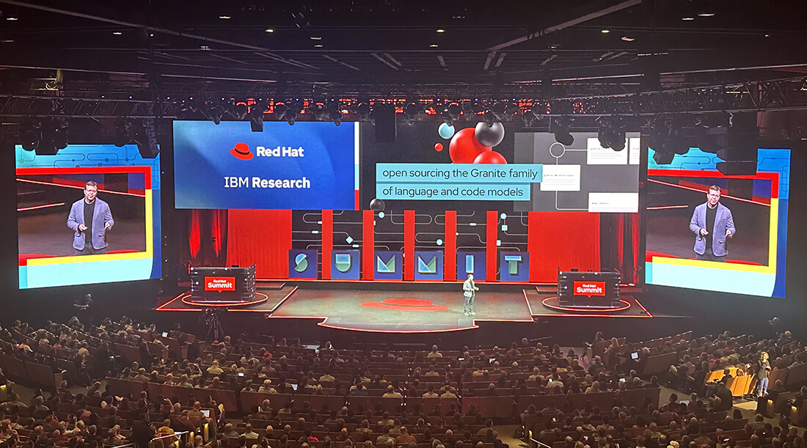
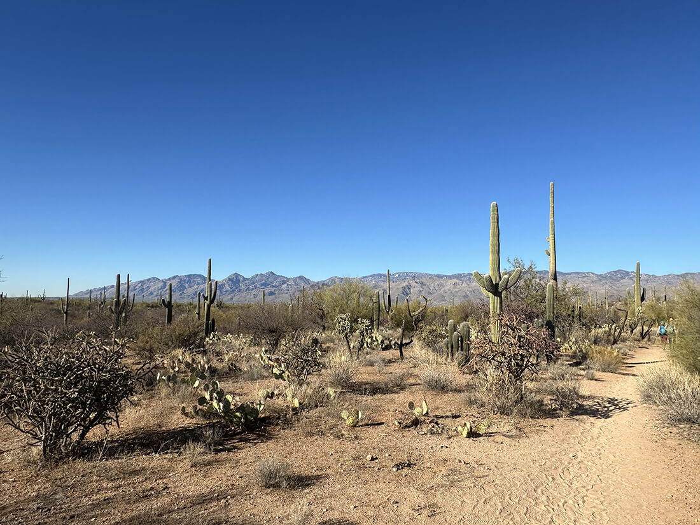
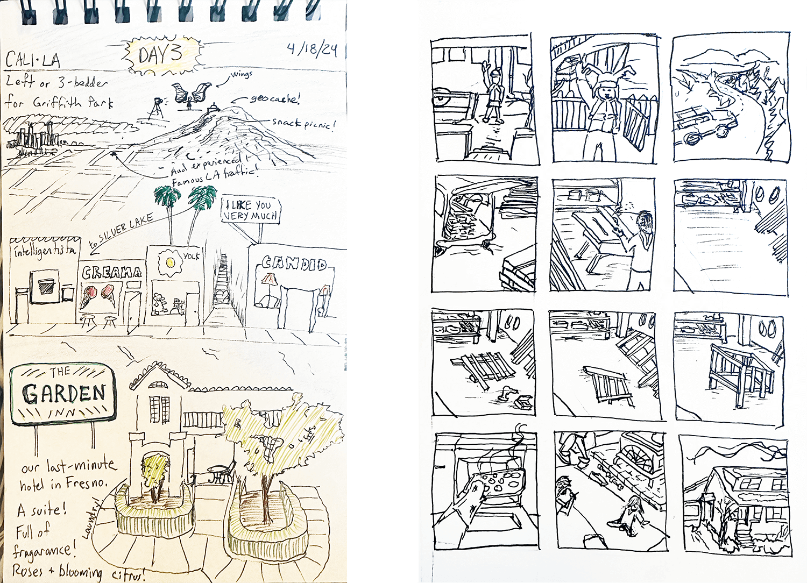

<section class="hero">
    <time class="meta-date" datetime="{{ date | postDate }}">Written: {{ date | postDate }}</time>

# {{title}}
{{description}}

</section>

<section>
    

  		
## Summary

Most of my life is taken up with family and my job, and both of those are generally fulfilling, although also draining. I didn't achieve my goal of doing daily deep work. I did some, but generally felt barely above water. It's tough out there, and I'll try again this year. 

- most consistent activity: pickup soccer on sundays
- poem I tried to memorize: [The Peace of Wild Things, by Wendell Berry](https://onbeing.org/poetry/the-peace-of-wild-things)
- proudest work project: user research about docs at Red Hat Summit
- favorite book: Wellness, by Nathan Hill
- favorite home related-thing: removed a chimney that was taking up space in the garage
- favorite record: Manning Fireworks, by MJ Lenderman
- favorite painted work: [Winter Blanket, by Eric G. Thompson](https://www.are.na/block/24724142)
- biggest high: youngest went to kindergarten
- lowest low: de quervains didn't clear up
- camping trips: 4
- big hikes: camels hump in winter, moosilauke mt in nh
- concerts: Chris Cohen, Flaming Lips
- favorite photo I took: weary travelers 
<figure>
    <picture>
        <source srcset="img/tired.webp" type="image/webp">
        <source srcset="img/tired.jpg" type="image/jpg">
        
    </picture>
</figure> 

## Books

#### Open Yale Course
I wound up working my way through the syllabus of [The American Novel Since 1945](https://oyc.yale.edu/english/engl-291).

It started with David Foster Wallace. I devoured his short stories in his collection Oblivion. The theme here is I apparently enjoy literary analysis; that is, hearing other smarties discuss what I just read. Like overhearing a book club in the library. A podcast about Oblivion turned me on to DFW's influences. Thomas Pynchon stood out and led me to read The Crying of Lot 49. The best analysis I found for THAT one was by the Yale professor of English. She videoed the class in 2008. 

This course was absolutely perfect for what I was looking for: a curated list of books by someone who knows how to pick books with a corresponding lecture or two.

After reading these, I'm about halfway through the list.

- Richard Wright, Black Boy
- Flannery O’Connor, Wise Blood
- Vladimir Nabokov, Lolita
- Jack Kerouac, On the Road
- J.D. Salinger, Franny and Zooey
- John Barth, Lost in the Funhouse
- Thomas Pynchon, The Crying of Lot 49
- Toni Morrison, The Bluest Eye

#### Other book highlights

- Down With The System, by Serj Tankian. While not a huge fan, SOAD was solidly within my musical world. I wasn't ready for the activism bend, but I stayed for it. Serj is an earnest fellow who inspires me to stand up for what I believe.
- At Work in the Ruins: Finding Our Place in the Time of Science, Climate Change, Pandemics and All the Other Emergencies, by Dougald Hine. I missed the local book signing, but it put the work on my radar. I adored Hospicing Modernity; the only book I’ve participated in book club for. This one is in the same genre: staring and wondering at the crumbling systems and institutions. 
- The Dispossessed: An Ambiguous Utopia, by Ursula K. Le Guin. My first Le Guin, this was a banger and also within the realm of critiquing the direction of the western world, this time through a sci-fi narrative written in the 70s.
- [Guantanamo Voices](https://www.mirkwork.com/guantanamo-voices-book): True Accounts from the World's Most Infamous Prison, by Sarah Mirk. I met the author at the non-fiction comics fest in vermont and bought the book immediately. It's beautiful and wrenching. 

## Travel

Trip to Poland to visit my wife’s family
<figure>
    <picture>
        <source srcset="img/poland.webp" type="image/webp">
        <source srcset="img/poland.jpg" type="image/jpg">
        
    </picture>
</figure> 

Family trip to Yosemite for a wedding
<figure>
    <picture>
        <source srcset="img/yosemite.webp" type="image/webp">
        <source srcset="img/yosemite.jpg" type="image/jpg">
        
    </picture>
</figure>

Work trip to Denver for the Red Hat Summit event
<figure>
    <picture>
        <source srcset="img/rh-summit.webp" type="image/webp">
        <source srcset="img/rh-summit.jpg" type="image/jpg">
        
    </picture>
</figure>

End of december trip to Tucson
<figure>
    <picture>
        <source srcset="img/tucsan.webp" type="image/webp">
        <source srcset="img/tucsan.jpg" type="image/jpg">
        
    </picture>
</figure>

## Home projects

When I think of home projects, what comes to mind is that the kitchen is done, even though it was finished in 2023. I’ve legally agreed not to mention the company that stretched out the remodel to 10 months of living with a jagged plywood countertop. So we’ll leave it at that. 

#### Replaced leaky and inoperable windows
Part of an addition from the 80s, they were the newest windows in the house, and the worst. Gigantic and, because the counterweight broke, heavy. The rest of the windows are original single-pane from 1937 and working fine.

We kept the holes the same size and put in sliders. The addition has the best view in the home, and the new windows accentuate that now. The next step is keeping it warm. The wood stove heat doesn’t make it out to that extremity well. 

#### Removed an old chimney
This one felt so so good. A weight was removed along with the concrete. It was tied to a wood stove that has since been removed and was once used to keep the aforementioned cold room warm. The chimney took up space in an already cramped garage and up on the roof, the bricks stayed in place by gravity. 

## Yard projects

#### Got us some chickens in the spring
I built [a coop](/blog/chickens-v1), which I was very proud of, because I have not built many things. We got 4 eggs a day from our 4 hens, 2 more recently due to the cold or lack of sun. 

#### Ran a decent annual garden
- yield: 60 lbs potatoes, lots of tomatoes, 20 delicata, 50 garlic
- duds: carrots, beets
- thrivers: kale, parsley, tomatillos (family doesn’t like them 😞), black beans (first time 🎉) 
- potatoes took a hit from burrowing chompers and jumping worms
- strawberries planted in tree guilds did better than in the bed
- set up drip irrigation, which was a game-changer

#### Maintained perennials
- boom year for raspberries (could be because I restrung their supports)
- average year for blueberries
- dud year from the apple tree (because last year was a boom). I plan to heavily prune it to even out the crops.
- was not faster than the quick birdies in getting elderberries or currants

#### Plant dreams
Plants I considered but didn’t get around to: mulberries. I had some delish local fruit in Bristol, from [Perfect circle farm](https://www.Perfectcircle.Farm/mulberry/mulberry-2hk6z). They also source trees. I failed at establishing lupin, but will try again. 

#### Other updates
- added 2 hazelberts and an apple, gifted by a neighbor
- added Japanese spirea near the river from the local classifieds
- moved 2 plum trees closer to each other to encourage cross-pollination
- added this organic material: 1 trailer of wood chips, 1 trailer of composted horse manure, and 9 bales of mulch hay

## Freelance

- Logo and website for [my parents' church](https://unitedchurchofunderhill.com) (and mine, he said reluctantly) 
- Graphic design for the 50th anniversary of our Harvest Market
- Website maintenance for [A Farm Between](https://thefarmbetween.com)
- Brochure design and copy for the Jericho/Underhill Food Hub

 
## Full-time work

I spent the year 90% dedicated to [docs.redhat](https://docs.redhat.com/). This was a big shift from focusing on [redhat.com](https://redhat.com/), as docs are more like a product than a marketing site. 

Software documentation guides users through every stage of product use, from onboarding to productive operation, maintenance, and troubleshooting. From the company's perspective, it's a self-service tool for users to get themselves unstuck and on to their goal. It's highly visited and gets 150k page-views every weekday. 

The project focused on separating docs from the support site and creating a standalone platform. This involved designing a new homepage, developing new templates, converting custom elements to design system components, and ensuring a seamless separation of docs from support content.

Collaboration: the 3-person design team (including me), 13 engineers, and spokespeople for the army of content writers.

#### Phase 1: migration
We had the thing moved in time for Red Hat Summit event. All 800k pages of it. To me, the highlight was the ease and quickness of using the components from our design system. Therefore, the work to adopt the header and footer was spent on a linking strategy and not functionality or responsive spacing. 

#### Side quest: user research
The team rallied behind seeing what people thought about the new site. The Red Hat event was filled with passionate users of Red Hat Documentation and was a perfect opportunity. I was part of a scrappy research team who led this work. Starting in january, we built a study to learn the sentiment of the updates and what users thought was missing. The study included a combo of survey questions and talk-aloud usability scenarios. It did not disappoint. I helped share out the results to 5+ teams and it's already shaped and prioritized features. It was the project I was most proud of this year.

#### Phase 2: migrating other sites to docs
A primary reason for giving docs its own url was to reduce the sprawl of other rh docs sites. Openshift docs was first. As it was, its content was basically duplicated on a separate site and on the new docs.redhat. The separate one had ux and organization that its users loved. So the team did our best to incorporate those features into the main site before we migrated.

## Successes

#### Never felt so generally content with my life
Honest. The stability of a good job and a family brings so much damn joy.

#### Gave a best man speech
Oof, I was anxious for about a year leading up to this one. While in front of the crowd I disassociated a tad while giving it, but it went well.

#### Still drawn to the manifesting teachings of [Neville](https://en.wikipedia.org/wiki/Neville_Goddard)
The takeaway is that I’m improving at imagining things working out. This is a profound shift in a head where negative self-talk has been a roommate for decades. New thought FTW. 

## Struggles

#### Social sensitivity
Occasionally, social situations trigger me to shut down and retreat in my head. When it happens, my self-awareness and overthinking skyrocket. I feel blocked, terrified of the spotlight. Diagnosing myself as a highly sensitive person (HSP) is the best explanation for how this feels. The label offers a framework to understand my behavior, challenges, and strengths, and has helped make sense of my past.

#### Dealing with a wet basement
Vermont had unprecedented flooding [again](https://www.theguardian.com/us-news/article/2024/jul/30/vermont-floods-storm-destruction-boat-rescues)... Water seeps into our concrete basement during heavy rain. A trench drain encircling the house could fix it, though it ain't cheap. The current solution is a sump pump in the corner of a floor that no longer slopes toward it. I spent two wet days troubleshooting that pump this year. While soggy, messing with the back-flow valve, I realized the importance of a fallback pump. My working plan is to add a second sump in the next lowest area of the floor, but I've been putting it off because of the idea of using a jackhammer, and also, the expanding list of home projects.

#### My wrist injury [de quervain's tenosynovitis](https://www.mayoclinic.org/diseases-conditions/de-quervain-tenosynovitis/symptoms-causes/syc-20371332#dialogId50205877) persisted
It happened november 2023. Out of nowhere, one day I woke up and my left thumb joint killed. Soon after I discovered what this freak syndrome is; also known as mommy or gamer thumb. I believe it became inflamed because of small repeated actions of using shortcuts on my keyboard for 20 years, playing guitar, and more recently, drums. The condition limits full use of my left thumb and flares while twisting a jar or carrying wood, so I baby it.

Early in the year, my doctor proved the injury was indeed this. I did some PT, wore a brace, got a split-keyboard, and saw no results. Later in the year, I went to a hand-wrist specialist and they said it's probably not healing because of my double-jointed thumb. It shows signs of early thumb arthritis. 

#### Screen fatigue
Occasionally, my body shuts down from seemingly too much screen time. It happens when I'm in long, back-to-back meetings. I get a sensation that starts in my eyes and I’m forced to lie down. I wonder how I ever got through 8+ hours of this while in the office. 

## Onward

2025 themes that make sense to focus on the day I'm writing this, december 31, 2024. Knowing they'll change and how I do not excel at proper goal setting, these are themes as goals are too damn rational. 

- prioritize meditating and reading over screens 
- push for opening up and sharing a bit of myself at work in every meeting 
- write more. Help fill the gap in support expressing myself besides through f2f, specifically by publishing blog posts and journal 
- deal seriously with anxiety; could be new tactics to improve recall or medication 
- do more adventures (more camping, more big hikes)
- try to make the above line up with full moons

<figure>
    <picture class="full">
        <source srcset="img/drawings.webp" type="image/webp">
        <source srcset="img/drawings.png" type="image/png">
        
    </picture>
    <figcaption>Did some image-based journaling here and there. Left one is from a day in california. Right one is from a random day at home.</figcaption>
</figure> 

	

</section>