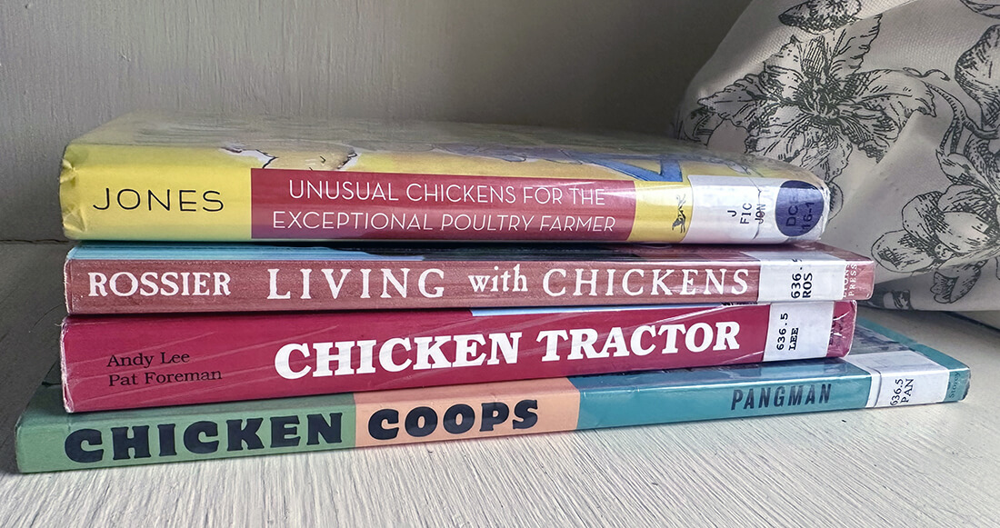
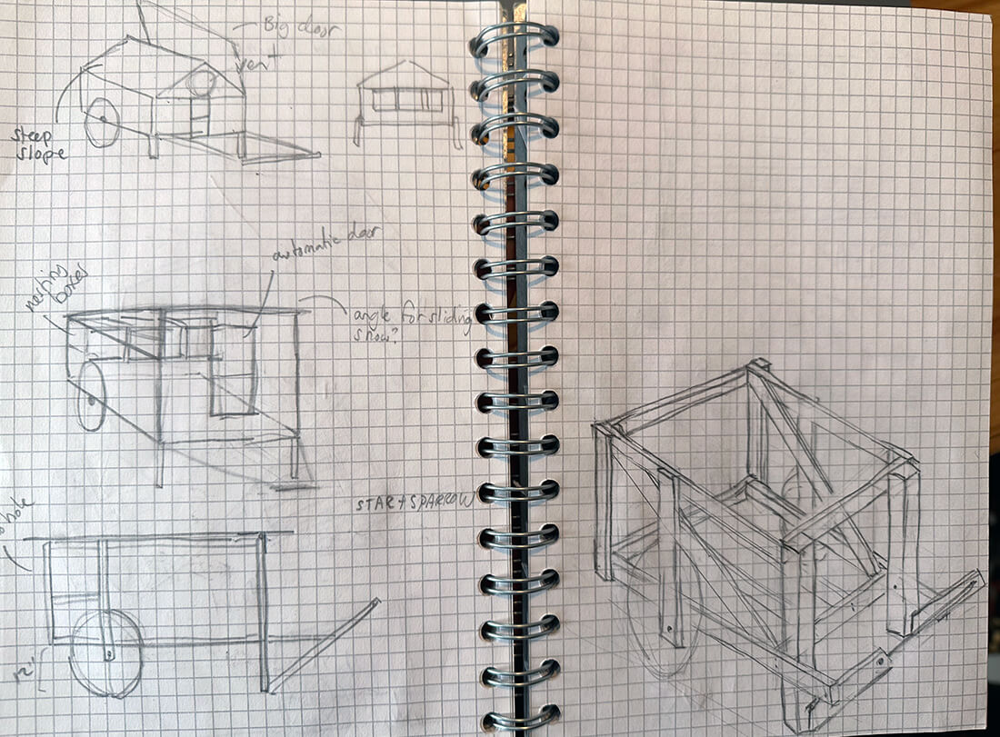
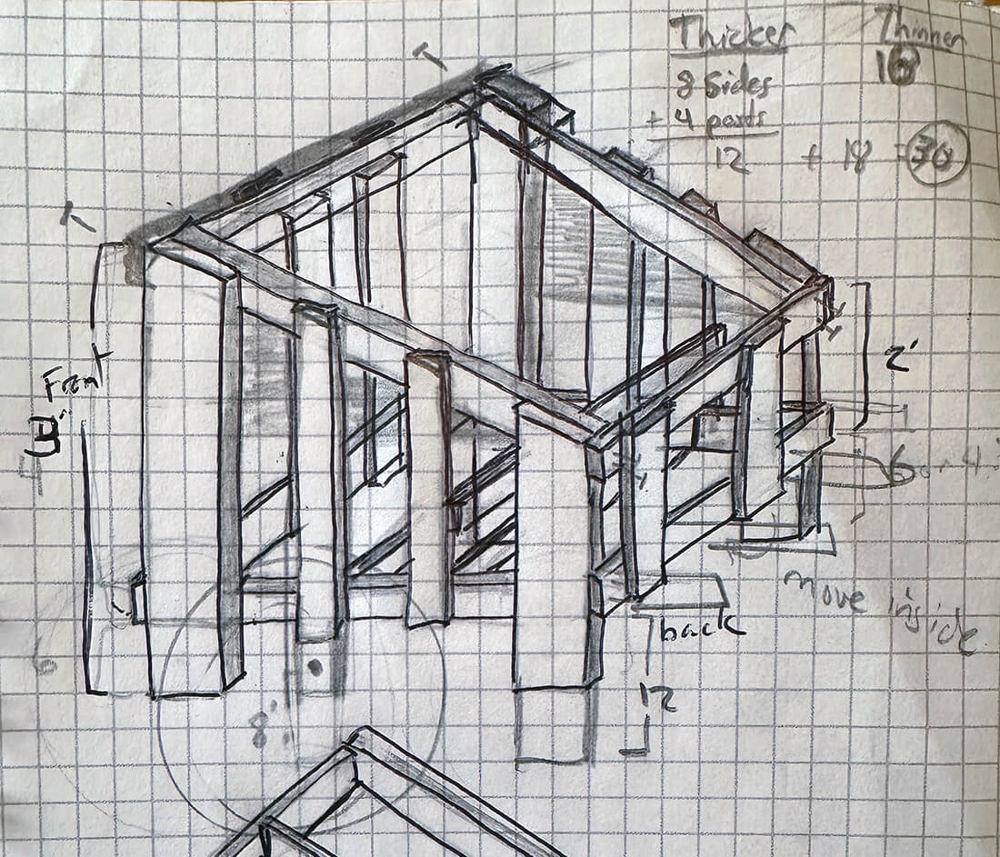
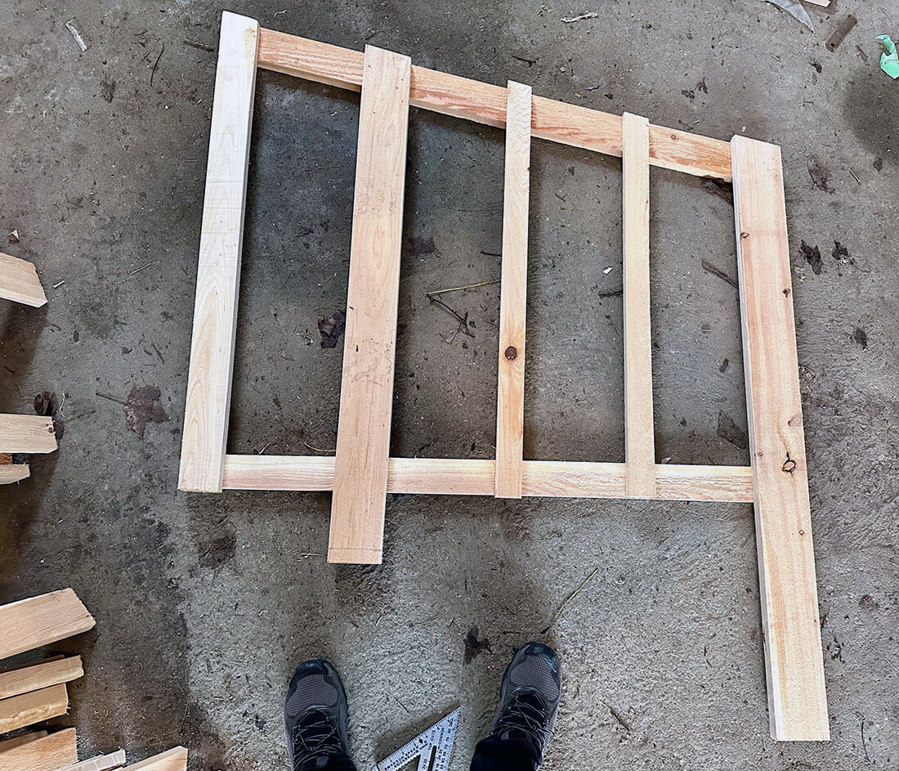
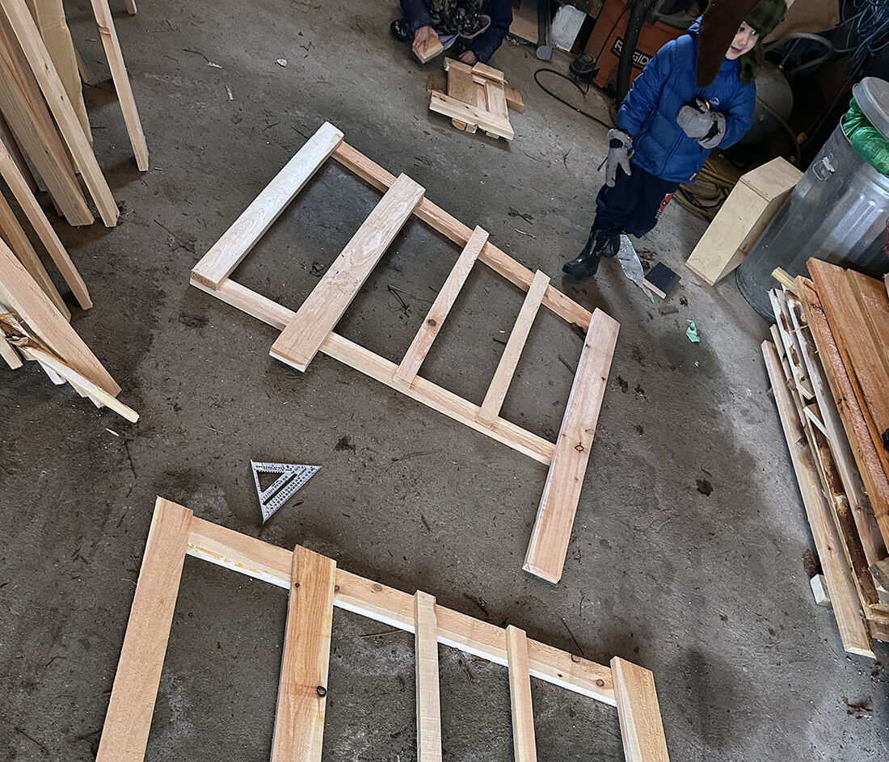
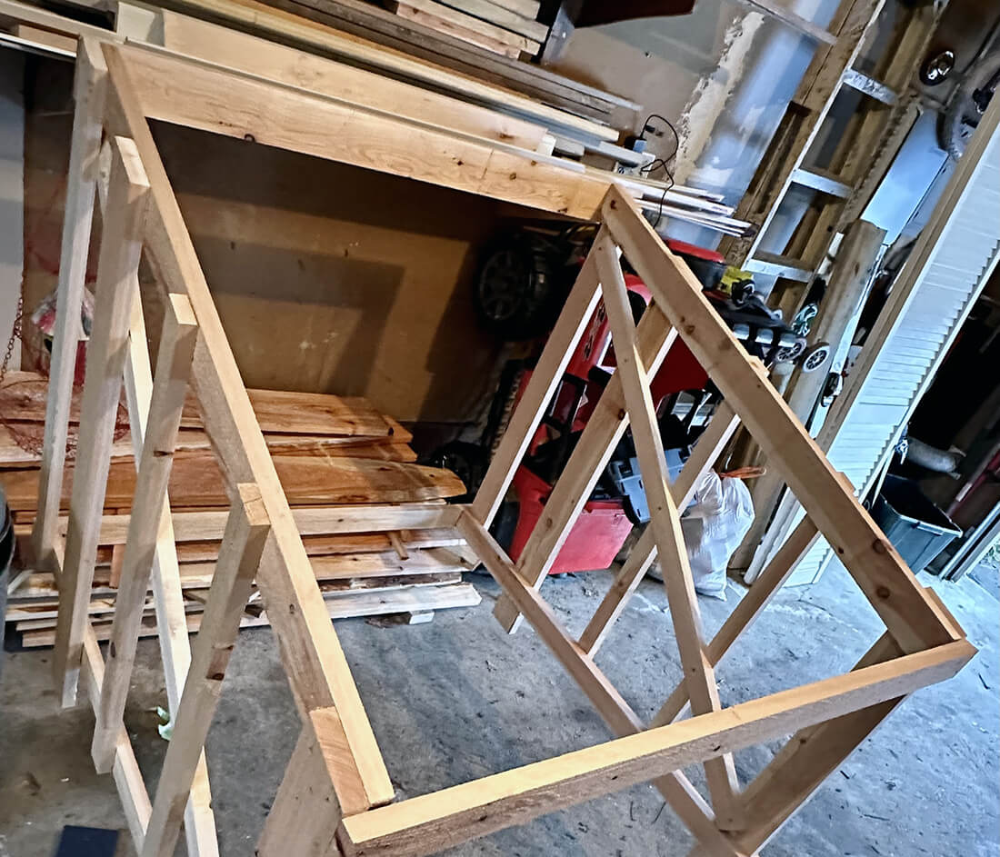
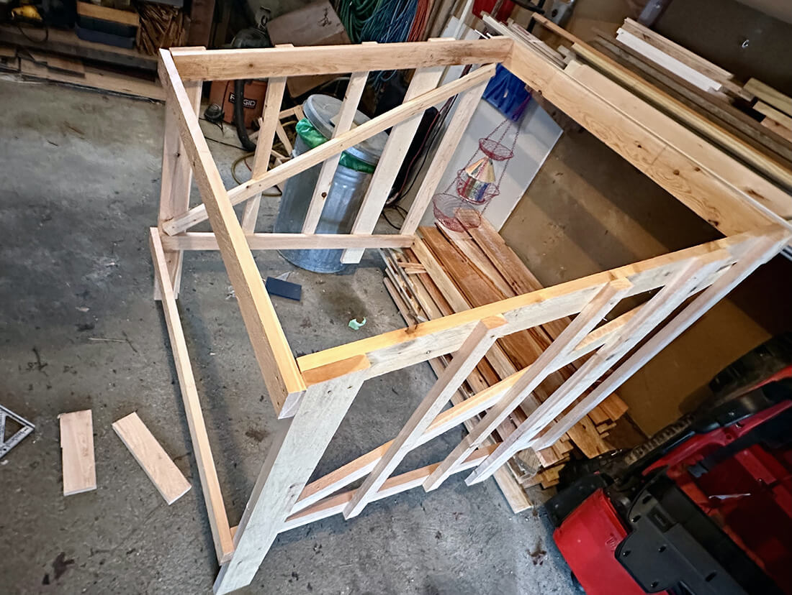
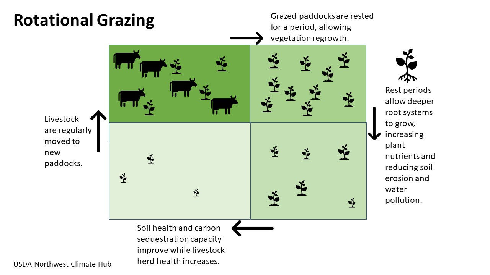

<section class="hero"><time class="meta-date" datetime="{{ date | postDate }}">{{ date | postDate }}</time>

# {{title}}

So, we don’t have them yet. This post intends to show the progress we’ve made. And I’ve always wanted to try the blogging techniques of writing as you go. Learning live. 

</section>

<section>
    

## So. Chickens.

It’s been 6 months since the idea started to take hold.

It’s felt pretty abstract and nerve-wracking from the start, but now that my nose has been in books and we have some supplies, it’s getting real. The anxiety is dimming. 

### Why?

Why subject our pure family to these miscreants?

1. Fresh eggs 
2. Fun experiment 
3. Teach the kids (and parents) about responsibility and I’m sure much more
4. Take more control of our families food

I didn’t grow up on a farm. Like those who don’t have hunters or military folk in the family, it felt far-away. A distant thing other people did, but not us. 

But here we are. Ever since buying a house on an acre, by a small river in late 2020, I’ve settling into the idea of permaculture. The previous owner helped push me down this path too by leaving legacy blueberries, an apple tree, and some raspberry rows. I’ve managed not to kill them and planted more trees and berries.

Chickens seems like a logical next step homesteaders take.

<blockquote>
    
Permaculture is a philosophy of working with, rather than against nature; of protracted and thoughtful observation rather than protracted and thoughtless labor; and of looking at plants and animals in all their functions, rather than treating any area as a single product system.
    <cite>Bill Mollison, permaculture's papa</cite>
    

</blockquote>

## Research

The step I tend to spend far too much time on. Surfing the webs and watching farm videos is safe. However, this felt different than getting lost in the research blackhole than other projects because there was commitment. I’ve told people about the plan. My wife is in. The kids are pumped and we’re doing it. 

Early on, I picked up a book from the free library in the town hall. It ended up being one beginner poultry folk consider a staple. 

<figure>
    <picture>
        <source srcset="img/fresh-eggs-daily.webp" type="image/webp">
        <source srcset="img/fresh-eggs-daily.jpg" type="image/jpg">
        
    </picture>
    <figcaption>Fresh Eggs Daily, by Steele, Lisa.</figcaption>
</figure>

I also ordered a slew of library books. One was chapter book for my 6 year old which is turning out to be great poultry propaganda. None of the others brought much new to the convo than I already gathered from blogs.

<figure>
    <picture>
        <source srcset="img/chicken-books.webp" type="image/webp">
        <source srcset="img/chicken-books.jpg" type="image/jpg">
        
    </picture>
    <figcaption>4 library books</figcaption>
</figure>

These sites have been helpful bookmarks thus far:

- <a href="https://practicalselfreliance.com/raising-chickens">Practical Self Reliance: How To Raise Chickens</a>: Gave it an honest view of the sacrifices it requires. From a Vermonters perspective.
- <a href="https://abundantpermaculture.com/category/animals/chickens/">Justin Rhodes</a>: Sells homesteading hard, the romantics and his products and tools
- <a href="https://www.backyardchickens.com/">Backyard Chickens</a>: The most popular community
- <a href="https://www.reddit.com/r/BackYardChickens">Chicken reddit</a>: Second most popular chicken hangout

## Coop
It was january and I set my focus on shelter and early supplies. Intermediary choices like chicken breeds could wait. My first decision was deciding to refer to as the Coup coop. In true permaculture fashion of minimizing inputs, I sought out used materials. 

Thriftiness or being cheap, as my friends called it, was built into my bones. I’ve been buying used since before it was cool. 

Local wins so far: 
- someone offered their beginner chicken supplies
- milk crates from hanniford grocery
- hardware like hinges and knobs from restore
- wheels from marketplace
- cedar cutoffs in St. Albans lumber yard
- 1/2 inch spruce planks from our small Underhill saw-mill

### Choosing the ChickSaw

When you’re researching small coops, you’ll inevitably stumble upon Justin Rhodes’ <a href="https://abundantpermaculture.com/mobile-chicken-coop/">ChickSaw</a>.

The romantic I am fell fast for its promise. It’s mobile, is low-maintenance, has instructions, has many followers, and is cheap! When I settled down, I became weary about the floor. 

A big benefit is not needing to clean the floor because the poops fall through the 1-inch square hardware cloth -- fertilizing the yard. 

Then the mink tracks by our river came to mind and those 1-inch holes started to seem roomy. Other folks have voiced similar concerns in the community.

I decided to play it safe. Being my first go at this whole farming thing and that there’s a steady flow of posts on our local forum about quitting chickening because of various vermin, I opted for a tight coop with an electric fence around it.

ChickShaw variations I liked:
- <a href="https://www.starandsparrow.com/journal/going-mobile">A more wood-based design</a>
- <a href="https://www.youtube.com/watch?v=Zw2mp0eYmdU">Video of other improvements</a>, including a door to protect the milk crates. 

### Drawings

I did a lot of drawings and exploration. Here’s a couple:

<figure>
    <picture>
        <source srcset="img/coup-coop-drawing-1.webp" type="image/webp">
        <source srcset="img/coup-coop-drawing-1.jpg" type="image/jpg">
        
    </picture>
    <figcaption>Inspired by the first link above</figcaption>
</figure>

<figure>
    <picture>
        <source srcset="img/coup-coop-drawing-2.webp" type="image/webp">
        <source srcset="img/coup-coop-drawing-2.jpg" type="image/jpg">
        
    </picture>
    <figcaption>What we landed on</figcaption>
</figure>

I kept a lot from the ChickSaw. It’s still a 4x4 box, but instead of being 2 feet tall, it’s 2 on one end and 3 feet on the other. Considering the snow, I didn’t love the flat top. It still opens for easy access. There will be 2 wheels and I still need to figure a handle to move the thing.

### The cedar frame

At the cedar craigslist location, I filled my my family-sized SUV up until it couldn’t fit anymore and headed to my dad’s to borrow his table saw. Then I ripped about four armfuls of 2x6es and 2x8ers down to 2x4s, 2x3s, and 2x1s. Fed up with planning, I began.

<figure>
    <picture>
        <source srcset="img/coup-coop-1.webp" type="image/webp">
        <source srcset="img/coup-coop-1.jpg" type="image/jpg">
        
    </picture>
    <figcaption>One side of the frame</figcaption>
</figure>

<figure>
    <picture>
        <source srcset="img/coup-coop-2.webp" type="image/webp">
        <source srcset="img/coup-coop-2.jpg" type="image/jpg">
        
    </picture>
    <figcaption>Both sides of the frame, unfastened</figcaption>
</figure>

<figure>
    <picture>
        <source srcset="img/coup-coop-3.webp" type="image/webp">
        <source srcset="img/coup-coop-3.jpg" type="image/jpg">
        
    </picture>
    <figcaption>Sides attached with 4 horizontals</figcaption>
</figure>

<figure>
    <picture>
        <source srcset="img/coup-coop-4.webp" type="image/webp">
        <source srcset="img/coup-coop-4.jpg" type="image/jpg">
        
    </picture>
    <figcaption>Getting three-dimensional</figcaptiensionalon>
</figure>

## Fence

The worry of creatures led me to buy to go down the route of the electric fence. I went with the tallest one possible. 

## How many

I’d like to shoot for 4 or 5 birds. I think the coop is big enough that during the winter they could live there for an extended time. For 4 birds, they'd get 4 square feet each. 

By the time winter comes around again, I may add a small outdoor run. As I walk around town, I see many neighbors have one too.

## Grazing method

<figure class="aside--right">
    <picture>
        <source srcset="img/rotational-grazing.jpg" type="image/jpg">
        
    </picture>
    <figcaption>Only imagine the cows are chickens. <a href="https://www.climatehubs.usda.gov/hubs/international/topic/rotational-grazing-climate-resilience">Source</a>.</figcaption>
</figure>

I’m going with the rotational paddocks strategy. 

We’ve avoided mowing certain areas of the yard for the past couple of years and I’m curious to see what they will do in the tall grass.

I have many young trees in the ground which are protected from deer already. Hopefully they’re also poultry-proof.

Another option is free-range. Our plot is sandwiched between two neighbor fences on either side. I’d like to test what happens when we open them to the full yard. One side, however, has some rowdy pups, which an electric fence would protect against.

## Tech

I’m going all out with this coop structure, yet I’m hesitant to invest in gadgetry too early. It’s a character trait like my thriftiness. The automatic chicken door is a-calling, but I feel it’s only proper to see what it’s like without it first.

To truly see the value of automation, you should understand the problem through experience first.

</section>

<section class="cta --curvy theme--dark">

This post is a work in progress. Thanks for stopping by. 

</section>