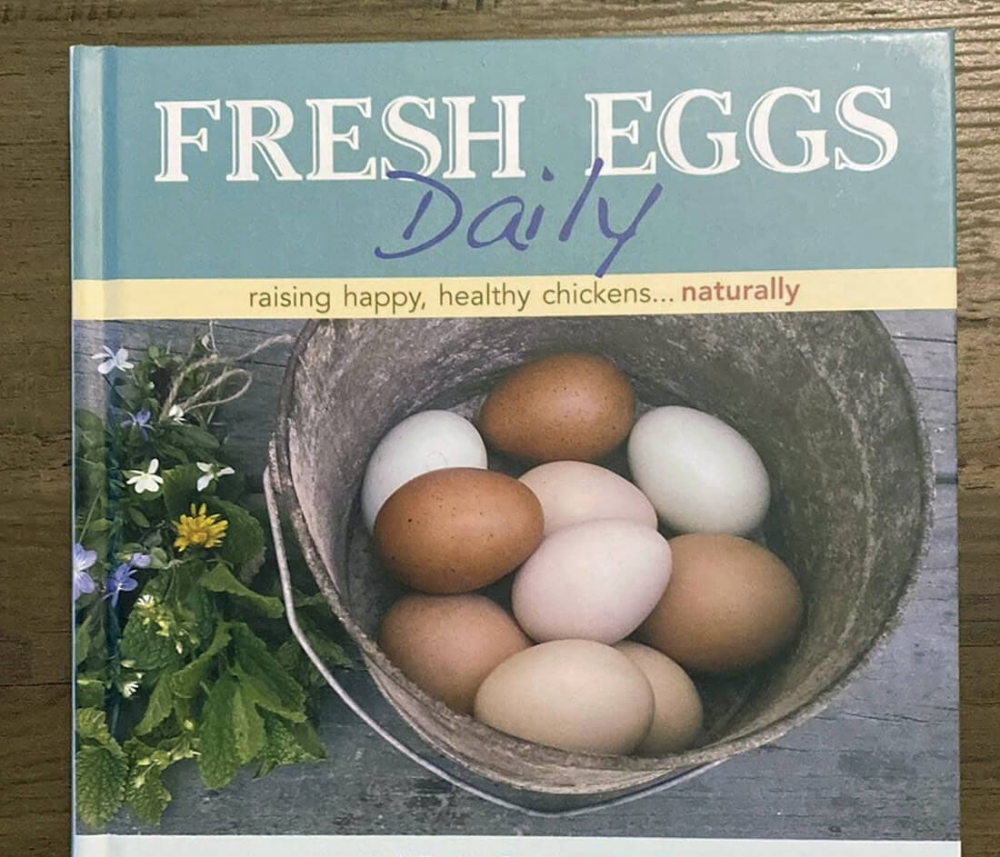

<section class="hero">

# {{title}}

So, we don’t have them yet. This post intends to show the progress we’ve made. And I’ve always wanted to try the blogging techniques of writing as you go. Learning live. 

</section>

<section>
    

Chickens. It’s been 6 months since the idea started to take hold.

It’s felt pretty abstract and nerve-wracking from the start, but now that my nose has been in books and we have some supplies, it’s getting real. The anxiety is dimming. 

## Why our fam is doing this?

1. Fresh eggs 
2. Fun experiment 
3. Teach the kids (and parents) about responsibility and I'm sure much more
4. Take more control of our families food

I didn’t grow up on a farm. Like those who don’t have hunters or military folk in the family, it felt far-away. A distant thing other people did, but not us. 

But here we are. Ever since buying a house on an acre, by a small river in late 2020, I’ve settling into the idea of permaculture. The previous owner helped push me down this path too by leaving legacy blueberries, an apple tree, and some raspberry rows. I’ve managed not to kill them and planted more trees and berries.

Chickens seems like a logical next step homesteaders take.

## Research

The step I tend to spend way too much time on. Surfing the webs and watching farm videos is safe. However, this felt different than getting lost in the research blackhole than other projects because there was commitment. I’ve told people about the plan. My wife is in. The kids are pumped and we’re doing it. 

Early on, I picked up a book from the free library in the town hall. It ended up being one beginner poultry folk consider a staple. 

<figure>
    <picture>
        <source srcset="img/fresh-eggs-daily.jpg" type="image/jpg" media="(min-width: 800px)">
        
    </picture>
    <figcaption>Fresh Eggs Daily, by Steele, Lisa.</figcaption>
</figure>

During this first period of researching,

what made the most sense to focus on was the coop and the early supplies I would need.

For as long as I've remembered, I prefer to buy used things.
    

</section>

<section class="cta --curvy theme--dark">

This post is a work in progress. Thanks for stopping by. 

</section>