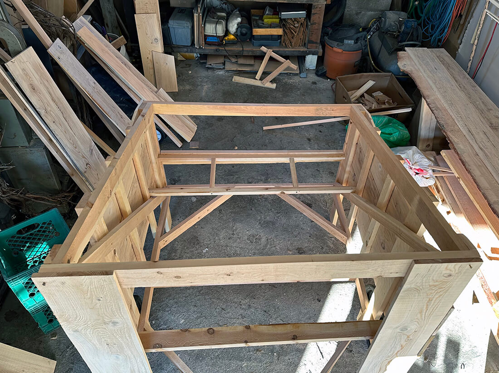
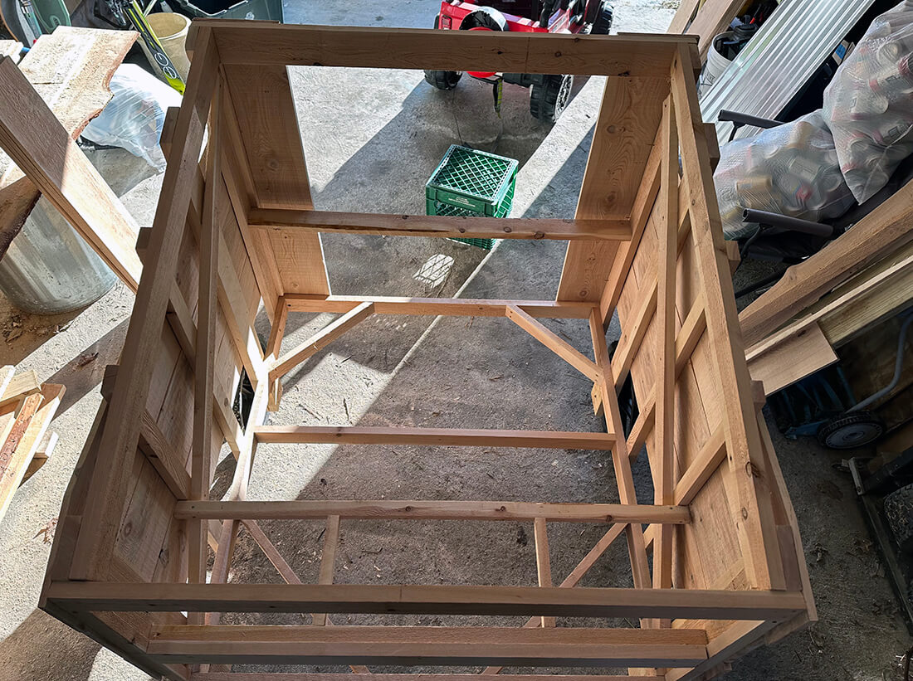
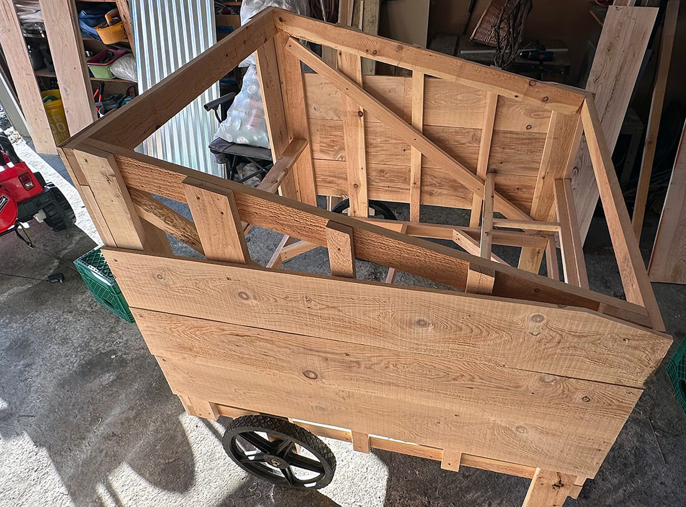

<section class="hero"><time class="meta-date" datetime="{{ date | postDate }}">{{ date | postDate }}</time>

# {{title}}

Chipping away at the coop, one month in.

</section>

<section>
    

## More wood

The cedar was great, but it felt thick at 1"-1.5" wide and might make the chickshaw heavy to do the whole thing from it. 

<figure class="aside--right">
    <picture>
        <source srcset="img/resawing.jpg" type="image/jpg">
        
    </picture>
    <figcaption>Turns out, resawing is easier with a sawmill</figcaption>
</figure>

I considered cutting it down to have 1/2" boards for the sides and bottom. "Resawing" it, they call it. As in, sawing-again, after the sawmill did its job.

I inherited a band saw a few years ago but I feel inept when behind it. Even if i wasn't, resawing like this is slow and uneven. It can also be done with a table saw, which I don't have yet, and with a circular or hand saw, but neither of those looked like fun.

Then I saw a craigslist post labeled <em><strong>"Rough cut hemlock framing."</strong> He had 8" x 1" boards available.</em> I asked if he'd be willing to cut them down to 1/2" and he agreed! 

He didn't even charge for the extra cuts so in total they came out to 50 cents per board foot. And were sourced from local trees, so that was pretty cool.

## Building

The pieces were gigantic at 16' for my little SUV, but I got them home without breaking the roof or having them fly off. After arranging them by my chop saw in my 17' garage, I cut them down. 

I overestimated on both the cedar and hemlock, but this building stuff is fun. I'm happy to have extra.

<figure>
    <picture>
        <source srcset="img/coup-coop-5.webp" type="image/webp">
        <source srcset="img/coup-coop-5.jpg" type="image/jpg">
        
    </picture>
    <figcaption>Tall side partially done. Will finish when the floor is done.</figcaption>
</figure>

<figure>
    <picture>
        <source srcset="img/coup-coop-6.webp" type="image/webp">
        <source srcset="img/coup-coop-6.jpg" type="image/jpg">
        
    </picture>
    <figcaption>Showing framing, including floor for nesting boxes</figcaption>
</figure>

<figure>
    <picture>
        <source srcset="img/coup-coop-7.webp" type="image/webp">
        <source srcset="img/coup-coop-7.jpg" type="image/jpg">
        
    </picture>
    <figcaption>Sides attached. Top triangle will be a vent.</figcaption>
</figure>

### The nest door works. I'm a carpenter!
Thought there'd be more to it. _shrug_

<figure>
    <picture>
        <!-- <source srcset="img/coup-coop-8.webp" type="image/webp"> -->
        <!-- <source srcset="img/coup-coop-8.jpg" type="image/jpg"> -->
        <source srcset="img/coup-coop-8.gif" type="image/gif">
        
    </picture>
    <figcaption>Excessively proud of myself for making a door work</figcaption>
</figure>

## To do

<ul>
    <li><strong>Get waterproof, cleanable flooring.</strong> I probably don't need this but it's been recommended, as this floor won't easily come out. </li>
    <li><strong>Figure roofing.</strong> I didn't think this one through. with the box being 4' x 4', I thought one 8' x 4' metal roofing panel would do, but nope. This didn't account for overlapping the panels and for overhang we'll want on each side.</li>
    <li><strong>Get hardware cloth</strong></li>
</ul>

</section>

