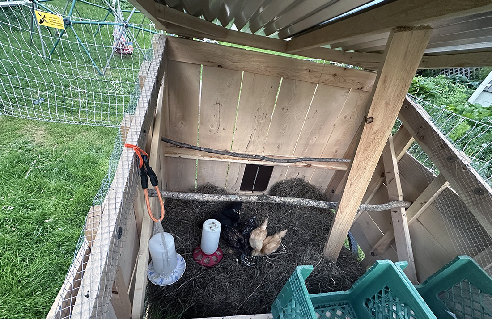

<section class="hero"><time class="meta-date" datetime="{{ date | postDate }}">{{ date | postDate }}</time>

# {{title}}

Big update since the last post. We got chicks which don't look like chicks anymore.

</section>

<section>
    

## Acclimating
This meant four weeks of having them grow and chirp and poop in the house, which unfortunately aligned with having guests three out of four of those weeks. The final week we put them in the mobile coop in the garage protected from the evening chill. Spring is when your winter dreams are realized.

After some tragic chick deaths and another run to tractor supply, we ended up with:
- 2 buff orpingtons
- 2 black marans
- 2 gold laced wyandotte

<figure>
    <picture>
        <source srcset="img/chicks-inside.webp" type="image/webp">
        <source srcset="img/chicks-inside.jpg" type="image/jpg">
        
    </picture>
    <figcaption>The six survivors under their heatlamp</figcaption>
</figure>

We picked them up from TS twelve weeks ago when they were one week old. Now they’re thirteen weeks and self sufficient. They enter their coop at night. They know the yard and appear not to stray beyond our boundaries.

Recently, we've discovered that one of the wyandotte's is a rooster. So, we'll see how that goes. 

 
## Final updates to the coop before rolling it out
1. Painted the floor with some leftover deck paint we had. After hemming and hawing about what to do for a surface for the interior, and never ending up finding a properly sized rubber mat in the marketplaces, I leaned on what was lying around the house. 
2. Used hardware cloth with big washers to secure the open holes for ventilation
3. Attached the roof. It ended up being a pain because I didn’t account for overhang. One sheet of 8‘ x 4‘ metal corrugated wasn’t enough for more than 2 inches of overhang.
4. Went with an automatic door

<figure>
    <picture>
        <source srcset="img/coup-coop-9.webp" type="image/webp">
        <source srcset="img/coup-coop-9.jpg" type="image/jpg">
        
    </picture>
    <figcaption>Chick-shaw un-weathered, inside electric fence</figcaption>
</figure>

<figure>
    <picture>
        <source srcset="img/coup-coop-10.webp" type="image/webp">
        <source srcset="img/coup-coop-10.jpg" type="image/jpg">
        
    </picture>
    <figcaption>Interior, free of poo</figcaption>
</figure>

## Summer is fast
Now though, I've become used to them being around and slowly transforming into a chicken-person. I turn off the fence in the mornings and open it for them to roam (an automating opportunity.) I try to remember to feed them before starting on work. Then I close it in the evenings when they've cooped themselves and turn it back on. I  experiement with what scraps they'll eat and what organics can skip the path to compost. I lean on neighors when we want to go away. I like having them around. 

</section>

<figure>
    <picture class="full" >

        <source srcset="img/coup-coop-11.webp" type="image/webp">
        <source srcset="img/coup-coop-11.jpg" type="image/jpg">
        
    </picture>
    <figcaption>Five ladies and our surprise rooster</figcaption>
</figure>

