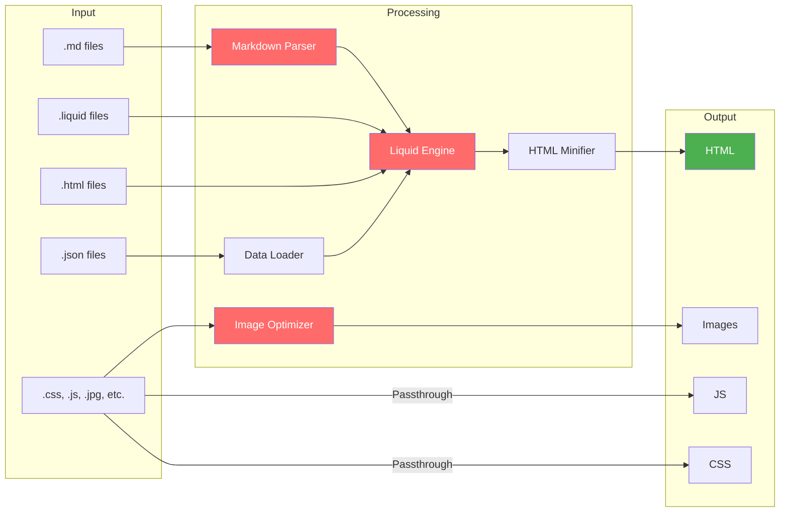
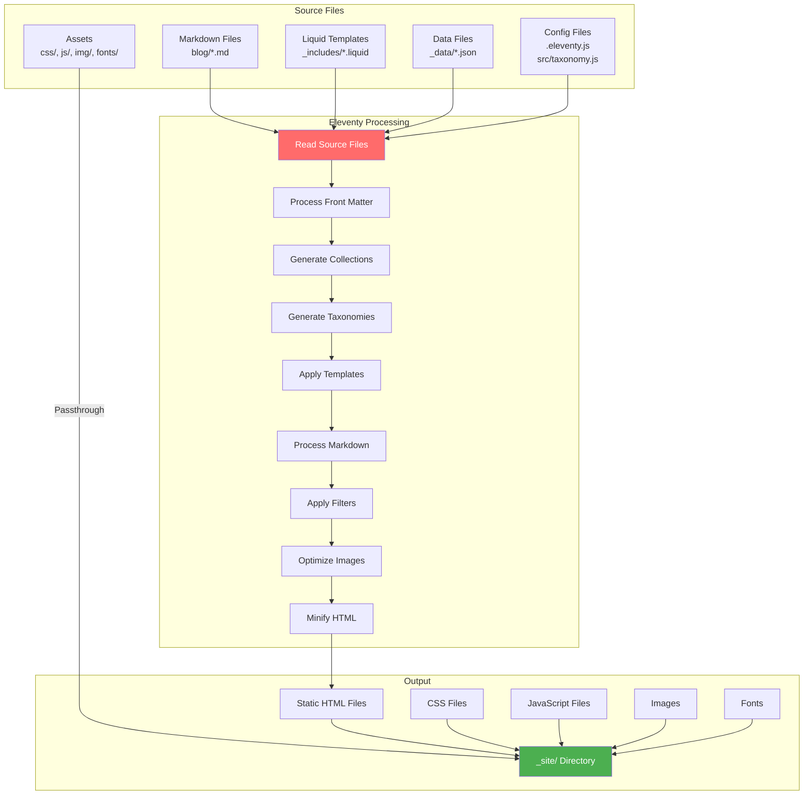

## Figuring out my why

Here I am. Designing in the open. This transparency about my decisions also helps to clarify them.

For a long time, this site has been my place to tinker. As a UX designer, I don't directly do any coding. This site is my sandbox for dev stuffs. It's also a place to practice writing, which I've found difficult as someone who grew up shy and without a lot of practice expressing myself. (rephrase)

## Phase 1: but does it float?

This step was a technical test and how the site has been for a few years. Could I figure out how to use a headless CMS like 11ty, and manage not to over-design it? The answer was yes for the tech, but the result felt... a little purposeless. It worked, but it didn't have a clear why, but maybe that was okay for a tinker site.

It was a random collection of things:

* Part-portfolio to collect previous work.  
* Part-freelance promotion (for services I don't really promote).  
* Part-personal blog about my interests (my yard, my chickens, my town).

## Phase 2: the site as collection

The new impetus for the site—the why—is to view it as a collection. Last month I made these updates. 

I have a theory that shy folks don't have the best memory because they don't repeat stories as often as our louder peers. The stories don't get settled as deep. This site could be my way of building a personal collection, an easily referencable log of my life.

Like many, I'm nostalgic for the days when the web was more fun and free in roughly 2000-2010. During that time, I discovered data visualization through Tufte then the meticulous [Feltron reports](http://feltron.com/FAR14.html). I fell for that intersection of logging your life, then visualizing the spreadsheets of data. I made a report for myself for 2 years. For one, it quantified how close my relationship was with coffee and alcohol then. The data told a story.

Anywho, for this phase, I added 2 new content types, including about 10 posts for each:

1. Concerts  
2. Hiking trips

They both seemed worthy of bubbling up to a modern collection and both almost always have photos associated with them. This is my fight against the staling of the photostream. A fight for my memories. Or, to stick with the digital garden metaphor, transplanting old plants to a healthier environment and giving them sun and water.

The hardest part wasn't the design, but in the painstaking backfilling of data, post by post. Where was this hike? How was the weather? Who was the opener? The activity has forced me to relive all of these experiences and force the memories back. The retrospect has been rewarding, refreshing. 2016 was a high-mark for quality concerts—both for me and for Burlington. The loss of [Arts Riot](/venue/arts-riot/) sucked. With it, went away $15 shows and an arty venue with a pulse on budding acts. 

### **Taxonomy**

I letting the content drive the design. I don't want to engineer something before knowing what I have to work with. I have a taxonomy.js file that builds out archive pages for artist, venue, peak, town, and state. I'm trying to make the URLs human-readable, not organized by date. It's a bit of a hodgepodge. So far, I decided to break the concert, trip report, and location directories out of the blog directory, but the individual posts stay within it. 

#### Overview

1. Blog Tags — Standard Eleventy tags from front matter  
    * URL: /blog/tag/{tag}/  
    * Some have descriptions in tagDescriptions.json  
2. Concert taxonomies  
    * Artists (/artist/{artist}/) — Can be single or array, supports festivals  
    * Venues (/venue/{venue}/) — Single venue per post  
3. Trip report taxonomies  
    * Peaks (/peak/{peakName}/) — Array of objects with name and elevation  
4. Location taxonomies  
    * States (/state/{stateName}/) — Single state per post  
    * Towns (/town/{townName}/) — Single town per post

#### The inevitable exceptions

* For Music Festivals: The festival is the primary heading, not a single artist. I didn't want a random performer to get the h1. See [Otis 2025](/blog/concerts/otis-2025/).  
* For Hikes: When I peak-bagged multiple summits in [one trip](/blog/trip-report/hancock-south-hancock-solid-butt-sliding/), I treat them both as primary artists, bubbling them to the h1.

### My 11ty set up 

I'm a perennial noob when it comes to any non-HTML programming language. Like my memories, whatever I learn in this space doesn't seem to stick. Here’s a little dump of my current setup (for you and me). 

JS Libraries

- [PhotoSwipe](https://photoswipe.com/) for slideshows, used on the homepage and [/art](/art/)  
- [Chart.js](https://www.chartjs.org/) for data visualization, used so far on the [trip report archive page](/blog/tag/trip-report/)  
- [Mermaid.js](https://mermaid.js.org/) for vector charts, used on this page  
- [exiftool-vendored](https://github.com/mceachen/exiftool-vendored) for reading image metadata to help automate creating blog posts from images in bulk

11ty plugins

- [@11ty/eleventy-img](https://www.11ty.dev/docs/plugins/image/) for image resizing, format conversion, and optimization  
- [@11ty/eleventy-navigation](https://www.11ty.dev/docs/plugins/navigation/) for generating nav structure from front matter  
- [@11ty/eleventy-plugin-rss](https://www.11ty.dev/docs/plugins/rss/) for RSS feed generation. I have plans to send out a newsletter for those interested in my new art posts newsletter someday.

#### Deployment flow

From local to prod, because this is still a new workflow for me.

#### 11ty build process

How 11ty transforms source files into a static site

## Phase 3: what's next?

### 1. Books

 I've moved my reading data from GoodReads to StoryGraph, and now I've landed on [**LibraryThing**](https://www.librarything.com/home). It seems to be run by some real, passionate, open-source library folks. 

The next step is to dig into their API. That sentence makes me a little nervous. I'm also not sure what I want it to look like. I don't want to recreate goodreads. I'd like to curate collections of 'impactful reads' and integrate existing collections like my [radical comics library](/blog/non-fiction-comics/).  and write individual "book reports" for the ones that matter. 

Some approaches I’ve considered and been inspired by:

* [Maggie Appleton](https://maggieappleton.com/libray) has a beautiful presentation with links to google books  
* [Emma Goto](https://www.emgoto.com/books) has a delightful compact design with compact reviews and essay-length posts  
* [Rob Weychert](https://v7.robweychert.com/blog/collection/reading-diary) has some reviews and some posts that are just log the date read

### 2. Plants

After books, I want to catalog my yard. I tend to plant a tree or shrub, I’ve toyed with the idea of creating an interactive map of all the trees and shrubs I'm planting. Maybe even an "age of the yard" slider to visualize what the place looked like hundreds of years ago and what these saplings will look like in the future.

### 3. Backfilling

And the final, massive step is to backfill everything. Can I get every hike I've ever been on? Every concert I've ever been to? I've kept almost all my concert stubs since high school. I would love for them to live digitally instead of in a shoebox.

So that's the plan. The site is evolving from a "purposeless" project into a true "collection" that serves as my personal memory palace. It's a place to tinker, a place to learn, and a place to practice. And most of all, it's fun.