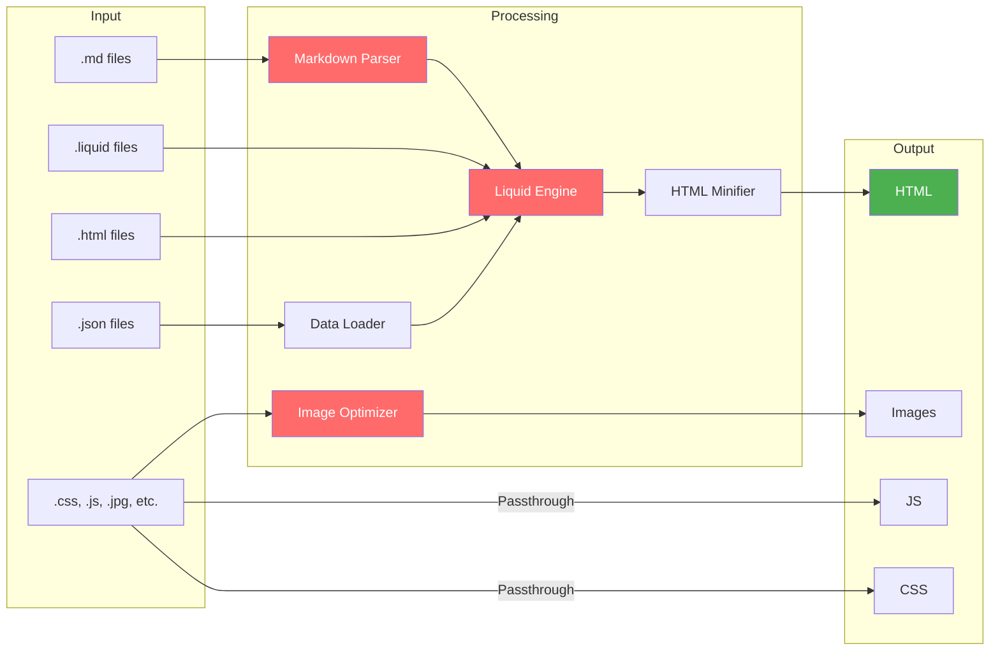
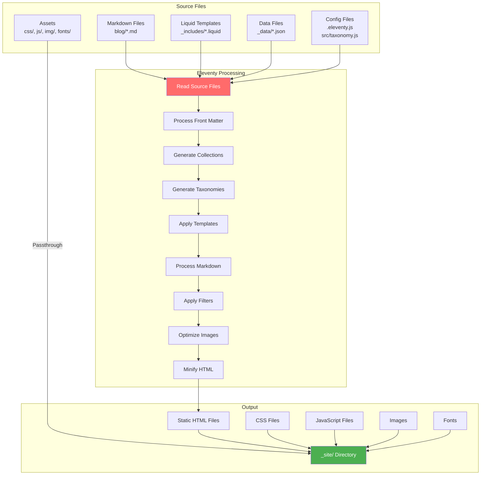

Here I am. Designing in the open. So far, I'm pleased to see this process of cataloging decisions help to clarify them as well. Without a plan, one keeps watering a vine, which can get unwieldy.  

Since its launch in 2007(?), it's been a place to tinker. Except for the job hunts or contract work, it was never a very practical thing. As an in-house UX designer for a decade I don't do much coding, so this is my digital back forty, my sandbox for dev and writing stuffs. This post is about the state of this site and where I'd like it to go, er, grow. 

## Phase 1: but does it float?

This initial shove-off was a technical test and how the site has remained for a few years. I came staggering away from one of those wild vines within the WordPress world. Could I figure out how to use a headless CMS like 11ty? Would I ever be able to explain 'headess CMS' to another? Could I manage to not over-design it? The answer was yes for the tech, but the result felt... a little purposeless. It worked, but it didn't have a clear why, but maybe that was okay for a tinker site.

It was a random bundle of things:

* Part-portfolio to collect previous work
* Part-freelance promotion 
* Part-personal blog about my interests (my yard, my chickens, my town, music, gift, ux)

## Phase 2: the site as collection

The new impetus for the site is to lean into viewing it as a collection. It's been in a folder called "stripped down" for too long. 

Framing your site as a collection of inter-linked notes, or a personal wiki is a rising trend. It rejects of the standardized reverse-chronological order seen on most blogs. A "digital garden" organizes posts associatively, with lots of cross-linking between. This is how my brain works. This format also highlights the uniqueness of one's interests. Since my collections of interests won't match anyone else's, why should our blogs be organized the same? Here's a directory of [other gardens](https://github.com/MaggieAppleton/digital-gardeners?tab=readme-ov-file#digital-garden-directory).

I have a theory that shy folks don't have the best memories because we don't repeat stories as often as our louder peers. The stories don't get settled as deep. This site could be my way of building a personal collection, an easy-to-recall reference of my life.

Like many, I'm nostalgic for the good old internet of the early 2000s when it was more open and had less platforms pulling the strings. Since then, in Anil Dash's words via [Rolling Stone](https://www.rollingstone.com/culture/culture-commentary/internet-future-about-to-get-weird-1234938403/), <em>"For an entire generation, the imagination of people making the web has been hemmed in by the control of a handful of giant companies that have had enormous control over things like search results, or app stores, or ad platforms, or payment systems."</em> In those days, I discovered data visualization through Tufte then the meticulous [Feltron reports](http://feltron.com/FAR14.html). I fell for that intersection of logging personal data then visualizing it, then I made a couple for myself. In doing so, it quantified how close my relationship was with coffee and alcohol then. That story shone through the data.

Anywho. Following that same line of collecting, for this phase, I added 2 new content types with about 10 posts for each:

1. Concerts  
2. Hiking trips

They both seemed worthy of remembering and both usually have photos. This is my fight against the decay of the photostream. A fight for my memories. Or, to stick with the digital garden metaphor, transplanting fond old plants to a healthier environment and giving them sun and water.

The hardest part wasn't the design, but in the painstaking backfilling of data, post by post. Where was this hike? How was the weather? Who was the opener? The activity forces me to briefly relive these experiences. To tell their story. Although boring at times, the retrospect has been rewarding, refreshing. I realized 2016 was a high mark for the number and quality of concerts—both for me and for Burlington. The loss of [Arts Riot](/venue/arts-riot/) set our little city back. With it, went away $15 shows and an arty venue with a pulse on budding acts. 

### **Taxonomy**

I'm trying to keep my hands off the wheel to let the content drive the design. I don't want to engineer something before knowing what I have to work with. I'm also shooting for more human-readable URLs, not organized by date. With only a few "collections," it's a bit of a hodgepodge. I decided to break the concert, trip report, and location directories out of the blog directory, but not the individual posts. With every post living under /blog, they should each resemble a blog. So I want some sort of essay or musing attached and not just a photo and a date. 

#### Overview

1. Blog Tags — Standard front matter tags
    * URL: /blog/tag/{tag}/  
    * Some have descriptions  
2. Concert taxonomies  
    * Artists (/artist/{artist}/) 
    * Venues (/venue/{venue}/) — Single venue per post  
3. Trip report taxonomies  
    * Peaks (/peak/{peakName}/) — Array of objects with name and elevation  
4. Location taxonomies  
    * States (/state/{stateName}/) — Single state per post  
    * Towns (/town/{townName}/) — Single town per post

#### The inevitable exceptions

* For Music Festivals: The festival is the primary heading, not a single artist. I didn't want a random performer to get the h1. See [Otis 2025](/blog/concerts/otis-2025/).  
* For Hikes: When I peak-bag multiple summits in [one trip](/blog/trip-report/hancock-south-hancock-solid-butt-sliding/), I bubble them both to the h1.

### My 11ty set up 

I'm a perennial noob when it comes to any non-HTML programming language. Like my memories, whatever I learn in this space doesn't seem to stick. Here’s what' I've added to the default install. For you and me both.

#### JS Libraries

- [PhotoSwipe](https://photoswipe.com/) for slideshows, used on the homepage and [/art](/art/)  
- [Chart.js](https://www.chartjs.org/) for data visualization, used so far on the [trip report archive page](/blog/tag/trip-report/)  
- [Mermaid.js](https://mermaid.js.org/) for vector charts, used on this page  
- [exiftool-vendored](https://github.com/mceachen/exiftool-vendored) for reading bulk image metadata to automate blog post template creation

#### 11ty plugins

- [@11ty/eleventy-img](https://www.11ty.dev/docs/plugins/image/) for image resizing, format conversion, and optimization  
- [@11ty/eleventy-navigation](https://www.11ty.dev/docs/plugins/navigation/) for generating nav structure from front matter  
- [@11ty/eleventy-plugin-rss](https://www.11ty.dev/docs/plugins/rss/) for RSS feed generation. I'd like to send an email to those interested in my new art posts someday.

#### Deployment flow

From local to prod (because this is still a new workflow for me.)

#### 11ty build process

How 11ty transforms source files into a static site

## Phase 3: what's next?

### 1. Books

I've moved my reading data from GoodReads to StoryGraph, and now [**LibraryThing**](https://www.librarything.com/home). It run by some real passionate, open-source library folks, whose monthly newsletter is called "State of the thing."

The next step is to dig into their API. That sentence makes me a little nervous. I'm also not sure what I want it to look like. I don't want to recreate goodreads. I'd like to curate collections of 'impactful reads' and integrate existing collections like my [radical comics library](/blog/non-fiction-comics/) and write individual "book reports" for the ones that matter. 

#### Approaches I’ve considered and look up to:

* [Maggie Appleton](https://maggieappleton.com/libray) has a beautiful presentation with links to google books  
* [Emma Goto](https://www.emgoto.com/books) has a delightful compact design with compact reviews and essay-length posts  
* [Rob Weychert](https://v7.robweychert.com/blog/collection/reading-diary) has some reviews and some posts that are just log the date read

### 2. Plants

After books, I want to catalog my yard. I've lost track of every tree or shrub I've invited into the soil here. Could be nice to transparently track that. An interactive map of every plant might be overkill, but something along those lines. I want low-upkeep, the same thing I want when I plant things. Maybe an "age of the yard" slider to visualize what the place looked like hundreds of years ago and what these saplings will look like in the future. 

For my annual garden this year, I went digital and tried to keep track of the planning and planting with a notion template: ([garden brain](https://alanmcgee.gumroad.com/l/gardenbrain).) It was over-engineered and required too much work. I fell off pretty early. 

### 3. Retroactive data gathering

And the final, massive step is to backfill everything. Which will actually be pretty fun. A nice time-suck activity requiring minimal brain power. Can I get every hike I've ever been on? Every concert I've ever been to? I've kept almost all my concert stubs since high school. I would love for them to live on beyond their shoebox.

So that's the plan.

Like every end of winter with the approaching longer days, a plan of thriving emerges. 