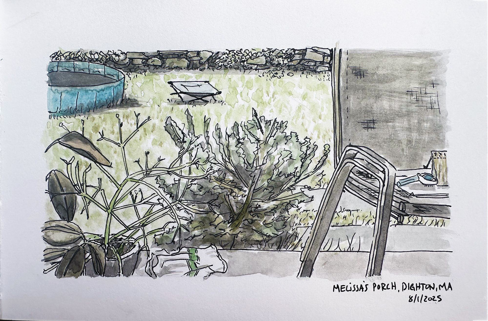
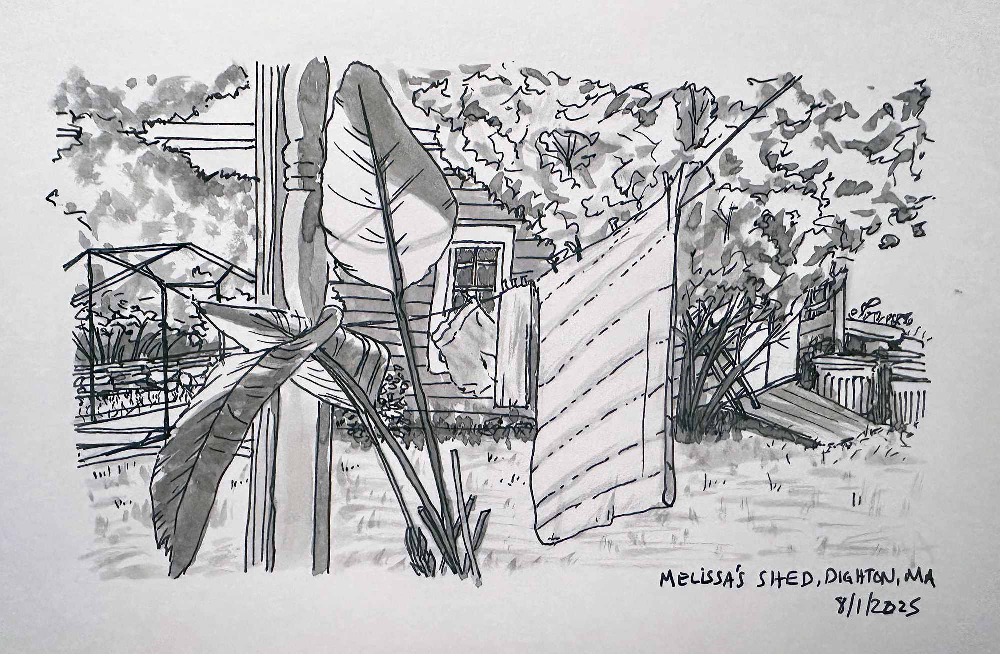

<section class="hero">
    <time class="meta-date" datetime="{{ date | postDate }}">Written: {{ date | postDate }}</time>

# {{title}}

</section>

<section>
    

Two small scenes from a friend's porch in mass this weekend. The star of the show here, apparently, are house plants. One seemingly leafless and stick-y, another with exaggerated leaves, clearly an out-of-towner.

The family was out for a few hours and I was home with the dogs, so for this one I actually sat and drew what I saw, as opposed to drawing from a photo. 

    
    

</section>