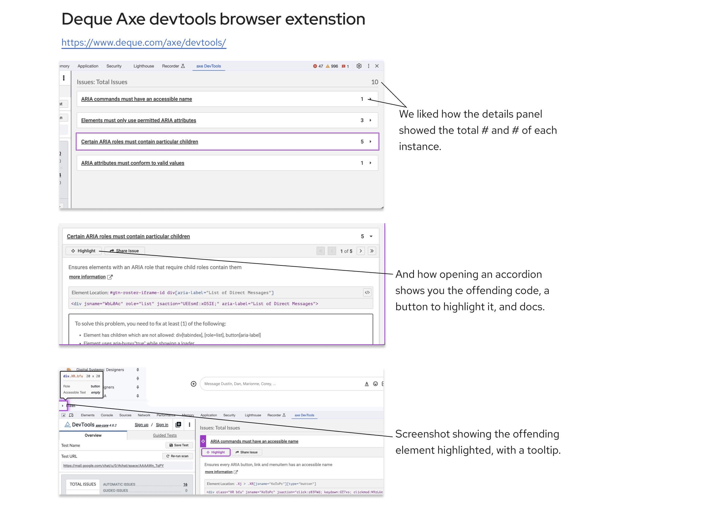

<section class="hero">

# Hackday 2023: automating accessbility within our CMS

Sharing the results from a cross-team collab session. 

</section>

<section>

The Red Hat website marketing group hosted a hacktoberfest in 2023. About 25 people signed up and we broke into five teams each. It's inspired by an agency we look up to [DigitalOcean](https://hacktoberfest.com/about/).

The focus this year was unsurprisingly on how to leverage AI and automation to achieve our goals. My team rallied around automating accessibility.

## Problem: lots o pages, lots o accessibility fails

We chose to focus on automating accessibility work. Starting with developers as an audience but laying a foundation for design and content teams. Our site(s) face accessibility challenges across thousands of pages, with varying issues. While our industry recognizes automation can't solve all accessibility issues, it can solve *some*.

We have tooling to score live pages, but nothing for checking unpublished ones. Nor do we have anything scalable to check against our internally adopted accessibility requirements.

### Our idea: An automated tool that checks accessibility compliance *before* they're published to the site.
The benefits
- No more spreadsheets (we use one for every project now)
- View a page's accessibility score easily (see previous item)
- CMS as a single source of truth for page-accessibility
- Serves all three focus areas (design, dev, content)
- Eventually could supports progressive completion via the waterfall workflow (ex. starts in Figma and is at 55/100 items, and when finally ready to publish by a content strategist/publisher is at 95/100.)
- Issue creating and resolving log

## Visuals

Each page on the website would have an "accessibility page health" page. This would allow anybody with access to the CMS to pop in and monitor accessibility. They could also sort all the pages based on the numerical number of health.

<figure>
    <picture class="full">
        <!-- <source srcset="img/cms-scorecard.webp"  type="image/webp"> -->
        <source srcset="img/cms-scorecard.jpg"  type="image/jpg">
        
    </picture>
</figure>

Separating the items into human and non-human buckets is a key feature. See the subjective section below.

<figure>
    <picture class="full">
        <!-- <source srcset="img/cms-scorecard-2.webp"  type="image/webp"> -->
        <source srcset="img/cms-scorecard-2.jpg"  type="image/jpg">
        
    </picture>
</figure>

While editing, the tool will constantly check itself against our standards. There will be a dedicated widget alerting the editor if any change they made breaks a guideline. 

<figure>
    <picture>
        <!-- <source srcset="img/cms-scorecard-3.webp"  type="image/webp"> -->
        <source srcset="img/cms-scorecard-3.jpg"  type="image/jpg">
        
    </picture>
</figure>

The widget was based on similar small-spaced solutions linked below.

<figure>
    <picture>
        <!-- <source srcset="img/cms-scorecard-4.webp"  type="image/webp"> -->
        <source srcset="img/cms-scorecard-4.jpg"  type="image/jpg">
        
    </picture>
</figure>

The widget allows you to locate the offenders directly on the editor page, and also explore more to learn why its offending.

<figure>
    <picture>
        <!-- <source srcset="img/cms-scorecard-5.webp"  type="image/webp"> -->
        <source srcset="img/cms-scorecard-5.jpg"  type="image/jpg">
        
    </picture>
    <figcaption>An element that's not following a guideline including a tooltip offering context</figcaption>
</figure>

## Figma checks

We didn't get to applying the idea to the designers' workflow. But the work on the widget above could be rebuilt and applied to a Figma plug-in that had a similar UX and UI. Some parts of it, like color contrast and spacing, we could automate, and the other half would be a checklist. In this case, Figma would be the source of truth for design accessibility health.

## Inspo

The widget was influenced by <a href="https://www.deque.com/axe/devtools/">Deque Axe devtools browser extenstion</a> and the <a href="https://www.drupal.org/docs/contributed-modules/ckeditor-accessibility-auditor">Drupal CKEditor Accessibility Auditor</a>, as they already had fantastically similar solutions.

<figure>
    <picture>
        <!-- <source srcset="img/inspo.webp"  type="image/webp"> -->
        <source srcset="img/inspo.jpg"  type="image/jpg">
        
    </picture>
</figure>

<figure>
    <picture>
        <!-- <source srcset="img/inspo-2.webp"  type="image/webp"> -->
        <source srcset="img/inspo-2.jpg"  type="image/jpg">
        
    </picture>
</figure>

## Doing vision work like this has long-term effects

This was my second hack-esque event and it was a blast. You get to exercise your ability to dream beyond constraints in ways that aren't possible in daily work.

*Sidebar:*

This morning I was thinking about how valuable a research-based analyst would be. Someone dedicated to tracking updates based on research would be ideal. We lack a way to measure how much research truly moves the needle... 

Spending time in vision-land, jolted this idea alive.

</section>

