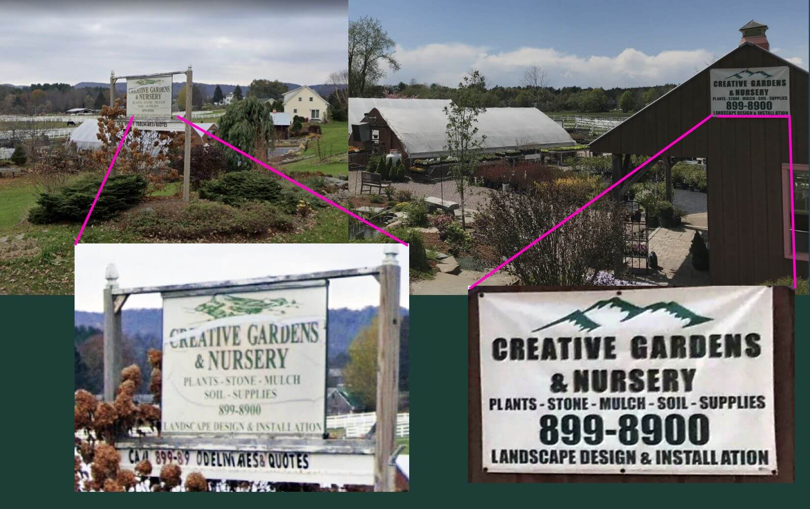
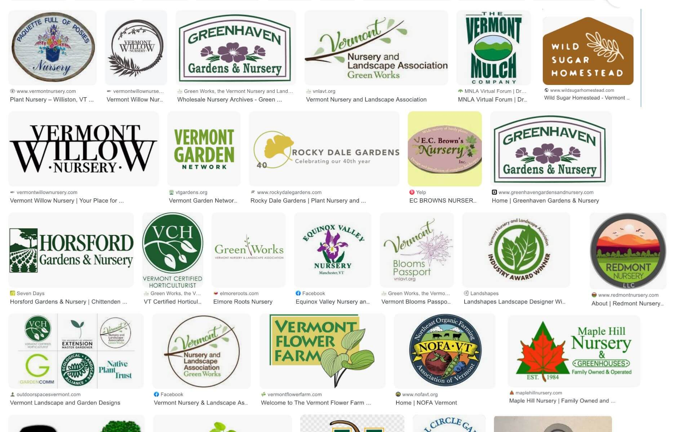
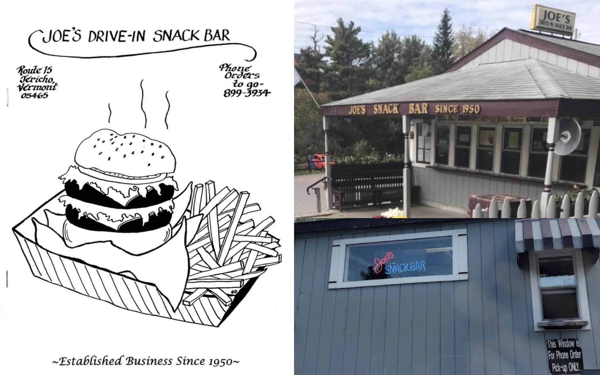
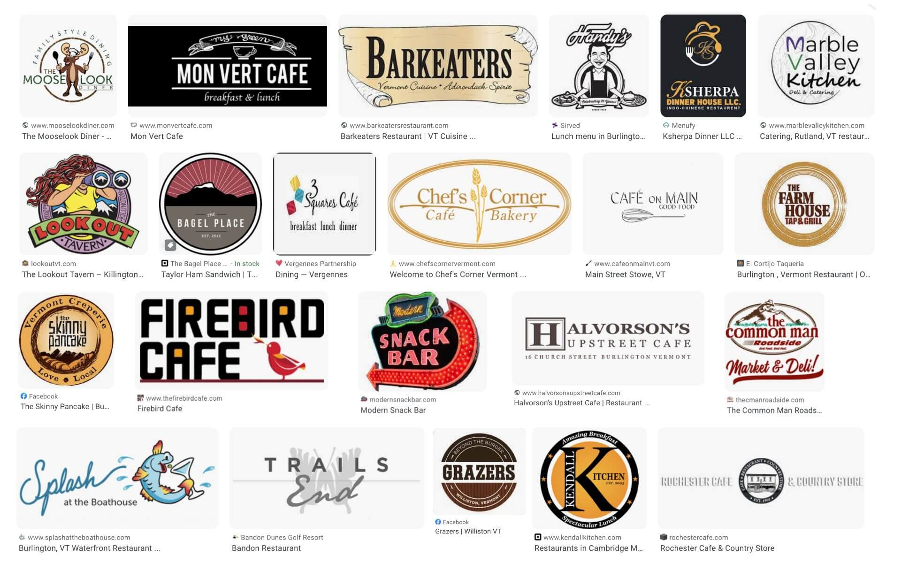
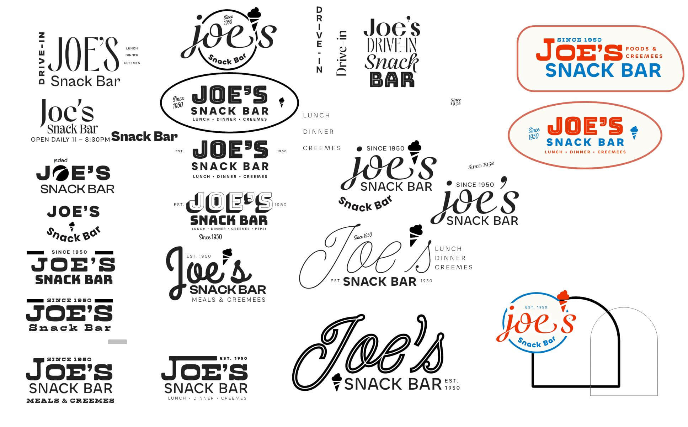

<section class="hero">

# Revamping 2 local logos without their consent
I wanted to summarize what goes into giving a brand a refresh, but I didn’t have it written down. I hadn’t cataloged the process during any actual projects. So I set out to pump some life into 2 local logos to do so. 

I chose businesses who’s signs I drive by often. They could each use some love / have many opportunities for improvement.

In both cases we’re talking about logos on signs, so part of this is work designing a sign. However the expression of a brand on a sign is going to be similar to a brand on any other medium. It’s thinking about who’s looking at it and what they need at that time.

</section>

<section>

## My message here is: many undervalue branding

Marketing is often seen as if it ain’t broke, don't fix it." True, word-of-mouth is still the most potent way to spread the word. Good work really does speak for itself. But here's the catch: new customers who don't know your company and its reputation only see the old sign outside.

So, while word-of-mouth is great, marketing is about inviting others in. Maintaining your brand helps you connect with new customers and create lasting bonds. 

When logos look old and worn out, it tells people the company and its service might be wearing out too. But when logos are fresh and clear, it shows that you're still in the game and here for the long haul.

## Logo 1: Creative Gardens & Nursery

They’re on a busy street I pass every time I need to drive pretty much anywhere. They’re great. I’ve put many of their plants in my yard.

<figure>
	<picture>
	 	<source srcset="img/existing-cgn.webp" type="image/webp">
		<source srcset="img/existing-cgn.jpg" type="image/jpg">
		
	</picture>
	<figcaption>Logo signs from the road</figcaption>
</figure>

### Assess current brand

- **Not sure about that mountain imagery.** It’s ubiquitous in Vermont and thus becomes invisible, not making you stand out. It it also loses points because it doesn’t have anything to do with the name or the industry.
- **Downplay phone number.** Not as important as it was 10+ years ago. 
- **Optimize for drivers.** Lay out the information so a driver-by going 40mph can digest it. They are the audience in this situation and the goal of the sign is to be memorable, so when the interested driver gets on their laptop, they can look the company up by name.
- **Add more character to fonts**. Since it’s all about creativity, why not make them look a bit more imaginative? Consider something earthy, but not too playful.
- **Make the signs match.** Currently both road-facing signs use different styling which is probably confusing.
- **Explore other names for business.** It doesn’t explain what they do and is a bit bland (and out of scope.)

### Research
To get familiar with the landscape and because I have no available owner to ask, I searched "nursery logo" on the popular designer-hangout [dribbble](https://dribbble.com/search/shots/popular/branding?q=nursery%20logo). I review these results with a grain of salt because they’re not representative of live projects -- they’re ideas that may be asking for critique.

<figure>
	<picture>
	 	<source srcset="img/dribbble-cgn.webp" type="image/webp">
		<source srcset="img/dribbble-cgn.jpg" type="image/jpg">
		
	</picture>
	<figcaption>How do others solve this?</figcaption>
</figure>
 
To move from ideas to the real, I searched the web for images using "Vermont nursery logos"and came up with these. They come from the top performing sites in this industry in our state.

<figure>
	<picture>
	 	<source srcset="img/google-cgn.webp" type="image/webp">
		<source srcset="img/google-cgn.jpg" type="image/jpg">
		
	</picture>
	<figcaption>How do actual companies in this space solve this?</figcaption>
</figure>

In both of these, I notice plant imagery, greens and browns, and fonts with a personality. Some are designed to be read from a distance more than others.

### Design
Now, let’s dive into the design software. First, I separate the text from the existing design to work on it separately. I begin by exploring various fonts, sticking to open-source ones that can be used commercially.

Choosing the layout goes hand-in-hand with the font selection. I ask myself, how can the elements work harmoniously together? What should be given priority?

After that, I move on to imagery. Is it necessary, or can we make better use of the mountain image we already have? Is there something more relevant that can be used instead?

Lastly, I approach the color scheme. It’s essential for the design to look good in black and white as well. I prefer to add colors in the end since they can sometimes distract from the overall design.

<figure>
	<picture>
	 	<source srcset="img/brainstorm-cgn.webp" type="image/webp">
		<source srcset="img/brainstorm-cgn.jpg" type="image/jpg">
		
	</picture>
	<figcaption>Exploring fonts, layouts, and images</figcaption>
</figure>

### Result

Note: when preparing the result image, I checked their site and realized their company name is different than the signs. 🤦🏼‍♂️ Yet, another reason to revamp. 

There are options for many applications here, one without the 5 words from the primary logo. If needed, an icon-only version could be used. The yellow, green, and plant would be recognizable on its own if the other version’s impact sticks. 

<figure class="full">
	<picture>
	 	<source srcset="img/result-cgn.webp" type="image/webp">
		<source srcset="img/result-cgn.jpg" type="image/jpg">
		
	</picture>
	<figcaption>How I solved for this</figcaption>
</figure>

 
## Logo 2: Joe’s Snack Bar

They have a great location on a sharp bend and have been doing their thing for 70 years. Incredible. In our town, they’re the greasy drive-in diner with cheap prices. We’re grateful to have them.
 
<figure>
	<picture>
	 	<source srcset="img/joes-existing.webp" type="image/webp">
		<source srcset="img/joes-existing.jpg" type="image/jpg">
		
	</picture> 
	<figcaption>Three signs in three different font styles</figcaption>
</figure>

### Assess current brand

They also have use different text on their signs and different variations of words too. On their menu, they use "Joe’s Drive-in Snack Bar," which embeds a retro-feel with text. It was probably something they used in the past.

- **Lean hard into a mid-century feel.** I’ve learned retro brands resonate from my working on brands of plumbers and HVAC companies that are second and third generation. 
- **Pepsi?** It’s on many of their signage, but feels outdated. 
- **Seemingly important bits**: that they offer creemees and the established date
- **Consider exposing what a snack bar is.** Is it obvious what’s available at a snack bar? 

### Research

What else do I need to know about Joe’s? I scrour around and find more signs.
<figure>
	<picture>
	 	<source srcset="img/joes-research.webp" type="image/webp">
		<source srcset="img/joes-research.jpg" type="image/jpg">
		
	</picture>
	<figcaption>How else has this name been expressed?</figcaption>
</figure>

I head over to dribbble and see some inspiring implementations of the mid-century design spirit pared with charming phrases.
<figure>
	<picture>
	 	<source srcset="img/joes-dribbble.webp" type="image/webp">
		<source srcset="img/joes-dribbble.jpg" type="image/jpg">
		
	</picture>
	<figcaption>How do others solve this?</figcaption>
</figure>

Then a web-search of "vermont diner logo" reveals some restaurants I’m familiar with, but nothing too relevant to our project needs.
<figure>
	<picture>
	 	<source srcset="img/joes-google.webp" type="image/webp">
		<source srcset="img/joes-google.jpg" type="image/jpg">
		
	</picture>
	<figcaption>How do actual companies in this space solve this?</figcaption>
</figure>

### Design

I feel like I have enough to go on. Maybe too much. This style is popular and full of potential, and I’d love to dive deeper into it. Inspiration is flowing, but to stay focused, I’ve time-boxed myself. For an actual project, this would be a time to chat with the owner to help narrow the direction. 

<figure>
	<picture>
	 	<source srcset="img/joes-brainstorm.webp" type="image/webp">
		<source srcset="img/joes-brainstorm.jpg" type="image/jpg">
		
	</picture>
	<figcaption>Pursuing a 1950’s aesthetic is a blast</figcaption>
</figure>

### Result

I end up being drawn to Americana colors. Nostalgia is what we’re aiming for, and I believe we have 3 perfect retro fonts to achieve that. The imagery shows the all-important soft-serve, and the supporting text emphasizes that it’s not just a snack bar but also serves lunch and dinner. The shape of the design takes inspiration from parking lot signs, adding to that retro vibe we’re going for.

There’s enough elements the brand can be oriented vertical, horizontal, or just with text. Digital or print ads will appreciate this versatility. The building signage is in good shape as it is, but updating it to match would unify the message. 

<figure class="full">
	<picture>
	 	<source srcset="img/joes-result.webp" type="image/webp">
		<source srcset="img/joes-result.jpg" type="image/jpg">
		
	</picture>
	<figcaption>How I solved for this</figcaption>
</figure>

## Now, I have steps!
Here’s the process to upgrade a logo:

1. #### Discovery & strategy
   * Assess the current brand to determine what working and what’s not
   * Understand the client’s business, mission, target audience, and competitors
   * Learn what elements of the brand are essential *(not applicable here)*
2. #### Research
   * Familiarize myself with the industry
   * Learn how other designers address branding in this 
3. #### Design
   * Refine brand messaging and tone of voice
   * Explore fonts and imagery that fit the companies personality 
   * Design the logo and visual elements
4. #### Refinement *(not applicable here)*
   *  Present brand concepts for feedback
   *  Incorporate client feedback to refine concepts
5. #### Launch! *(not applicable here)*
   * Implement the new brand across various touchpoints
   * Support in maintaining the brand over time

I want to be clear that a real logo project involves A LOT of talking with the owner. We want to ensure it communicates the right thing. With this blog post and project I skipped all that in order to give a truncated version of the high-level steps.

</section>
<section>
	
## What now?

I suppose here I would add in a call-to-action to you, reader. But, it’s summer and I’m not sure I have time for more freelance work. 

However, my drive to make things is sometimes stronger than the logic of planning. These fake logos got created somehow, didn’t they?

### SO! 😁
Do reach out if you’d like to put some life and love into your old logo / sign.

