<section class="hero">

 
    At each of my computer jobs, I wound up finding a nearby place that became a home base of sorts, on lunch breaks - my break from people and screens. This happened viscerally and unintentionally. Apparently, my mind and body required it and I abided.

</section>

<section>
	

## Typically I consider myself terrible at maintaining new habits.

This one stuck because the need was deep. Repetition in a routine like this deepens your awareness of a place. The place becomes a character in the story and a relationship between the two of you begins. You pick up new observations with each visit and a mental replica gets constructed in the psyche, with a layer of detail added on each visit. This layering isn't linear; instead, complexity deepens in unpredictable ways, like humans.

When I was thinking about writing this post, previous sacred places from my past bubbled up as landmarks in my timeline. Countless tree forts, the weird attic that had a tiny door off my bedroom… most of them were outside. Maybe that’s because indoors was too populated, too busy, too disconnected. I had a drive to create little worlds that were better with a few buds, some were better in solitude.

Below is a snapshot of places like this in adulthood.

## Brady People ID, Burlington, MA

I don't have photos from this era because this was before phones had a decent camera and my lunch spots weren't photogenic anyway. They took place either in the office or browsing Newbury Comics and Barns & Noble. 

Meandering the aisles was darn fulfilling and I’d always exit with my mental batteries topped off. I'd take an hour to flip through the new heavy-paged Rosenfeld Media book on ux or css. This era was also the dawn of podcasting. I’d often listen to shows like radiolab while scarfing down wendy's dollar menu items. Though more commercial and not sacred, these were my retreats.

## Brady People ID, Billerica, MA

The office moved and more of my breaks were spent outside exploring. This north-central region of Massachusetts was new to me. I don’t remember having one specific spot, but I got that hip new Instagram app and an even hipper panorama app which inspired capturing photos. 

 
<figure>
    <picture class="full">
    	<source srcset="img/burlington-billerica/edge-of-parking-lot-mist.webp" type="image/webp">
    	<source srcset="img/burlington-billerica/edge-of-parking-lot-mist.jpg" type="image/jpg">
        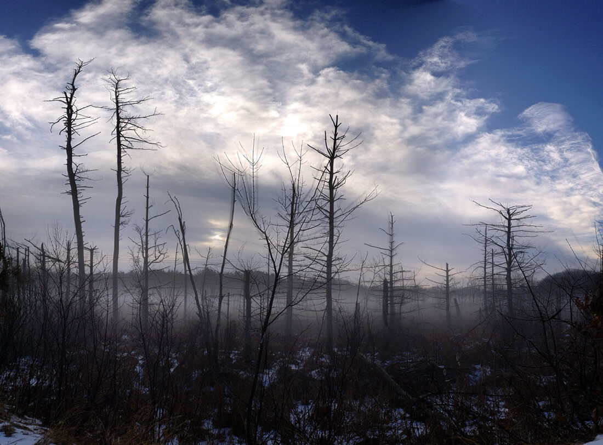
    </picture>
    <figcaption>Creepy morning mist next to the parking lot</figcaption>
</figure>

<figure>
    <picture class="full">
    	<source srcset="img/burlington-billerica/coke-break.webp"  type="image/webp">
    	<source srcset="img/burlington-billerica/coke-break.jpg"  type="image/jpg">
        
    </picture>
    <figcaption>Coke break</figcaption>
</figure>
<figure>
    <picture class="full">
    	<source srcset="img/burlington-billerica/office-grass.webp"  type="image/webp">
    	<source srcset="img/burlington-billerica/office-grass.jpg"  type="image/jpg">
        
    </picture>
    <figcaption>Ornamental, probably non-native grass</figcaption>
</figure>
<figure>
    <picture class="full">
    	<source srcset="img/burlington-billerica/two-and-four.webp"  type="image/webp">
    	<source srcset="img/burlington-billerica/two-and-four.jpg"  type="image/jpg">
        
    </picture>
    <figcaption>Four, two</figcaption>
</figure>

<!-- <figure>
    <picture class="full">
    <source srcset="img/burlington-billerica/billerica-wormhole.jpg" alt="Misty clouded sunset reflected on a car roof in webpommercial parking lotwebp
    <source srcset="img/burlington-billerica/billerica-wormhole.jpg" alt="Misty clouded sunset reflected on a car roof in a commercial parking lot" >
        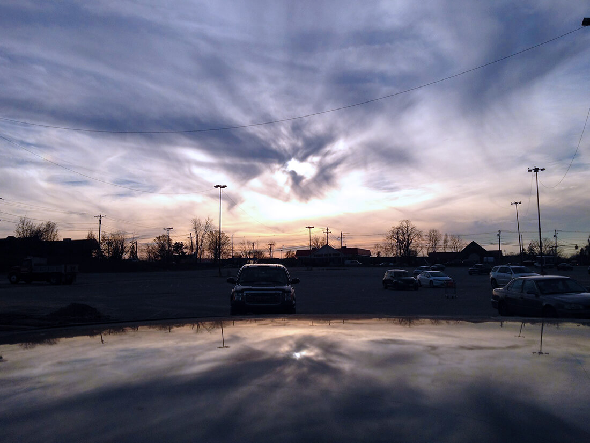
    </picture>
    <figcaption>Billerica wormhole</figcaption>
</figure> -->

<figure>
    <picture class="full">
        <source srcset="img/burlington-billerica/lot-and-grasses.webp" type="image/webp">
        <source srcset="img/burlington-billerica/lot-and-grasses.jpg" type="image/jpg">
        
    </picture>
    <figcaption>Windy lunch spent in the car</figcaption>
</figure>

<figure>
    <picture class="full">
    	<source srcset="img/burlington-billerica/jim-farmer.webp"  type="image/webp">
    	<source srcset="img/burlington-billerica/jim-farmer.jpg"  type="image/jpg">
        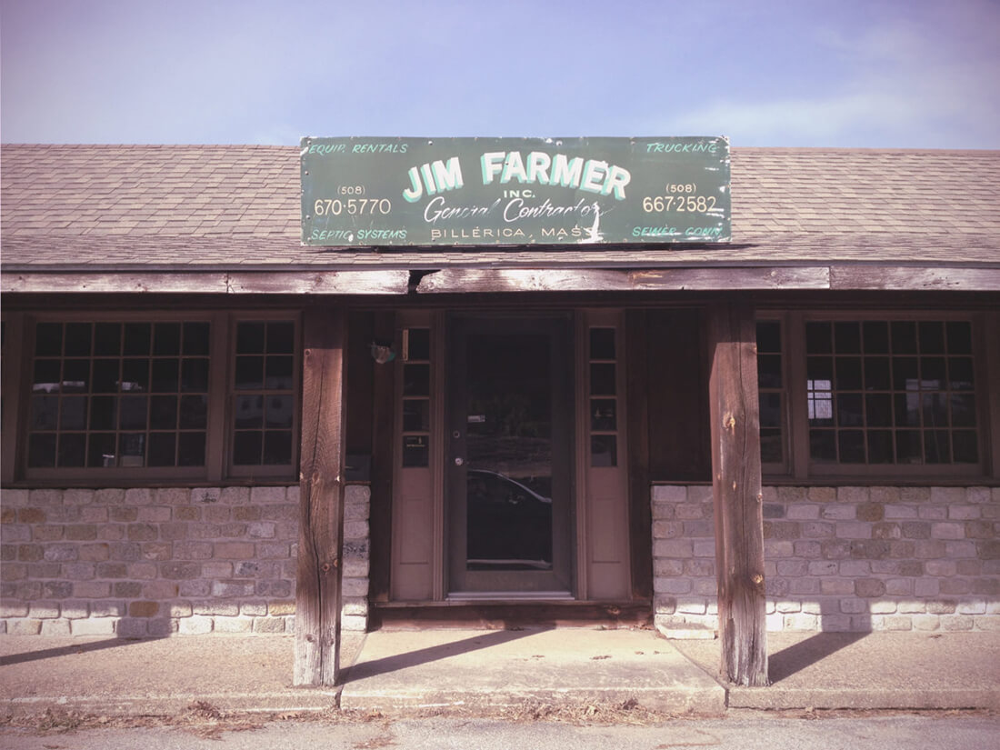
    </picture>
    <figcaption>Vacated shop</figcaption>
</figure>

<figure>
    <picture class="full">
    	<source srcset="img/burlington-billerica/off-season-pergola.webp"  type="image/webp">
    	<source srcset="img/burlington-billerica/off-season-pergola.jpg"  type="image/jpg">
        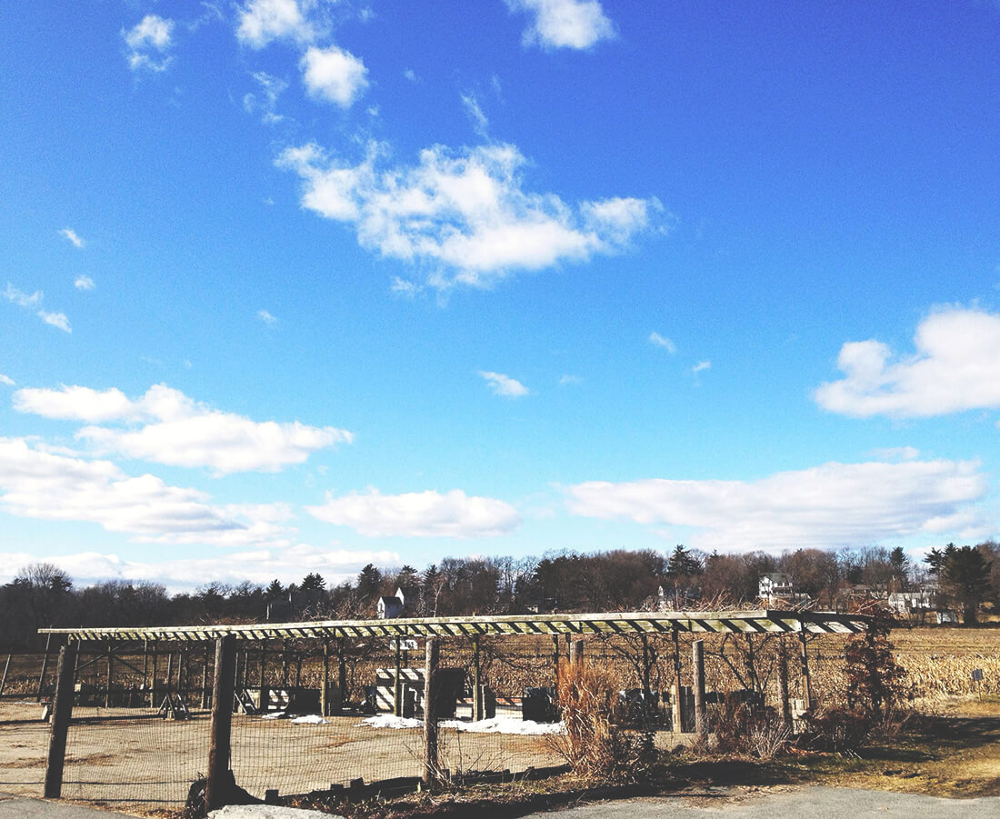
    </picture>
    <figcaption>Quiet garden center</figcaption>
</figure>

<figure>
    <picture class="full">
    	<source srcset="img/burlington-billerica/spring-forest-path.webp"  type="image/webp">
    	<source srcset="img/burlington-billerica/spring-forest-path.jpg"  type="image/jpg">
        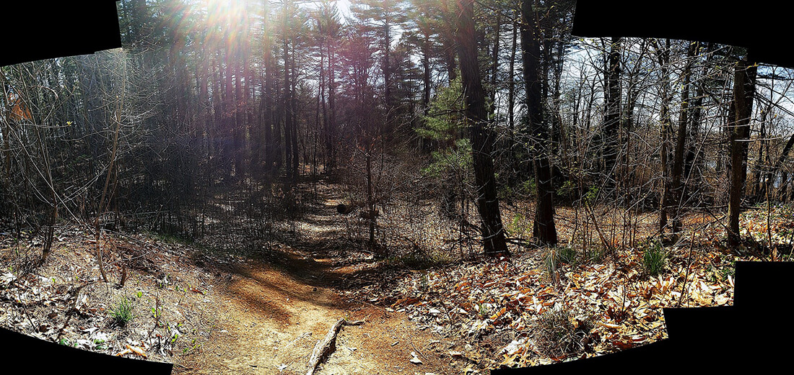
    </picture>
    <figcaption>Relishing the panoramic capabilities of a 2011 phone</figcaption>
</figure>

<figure>
    <picture class="full">
        <source srcset="img/burlington-billerica/water-tower-kmart-parking-lot.webp" type="image/webp">
        <source srcset="img/burlington-billerica/water-tower-kmart-parking-lot.jpg" type="image/jpg">
        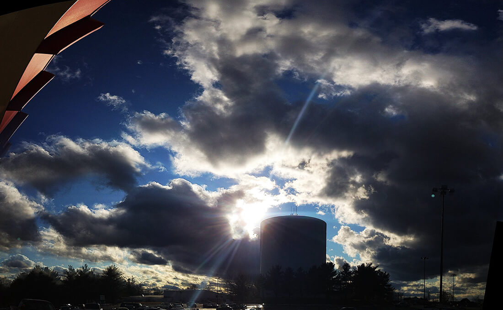
    </picture>
    <figcaption>Panorama of the town water tower from kmart</figcaption>
</figure>

<figure>
    <picture class="full">
    	<source srcset="img/burlington-billerica/billerica-rain-forest.webp"  type="image/webp">
    	<source srcset="img/burlington-billerica/billerica-rain-forest.jpg"  type="image/jpg">
      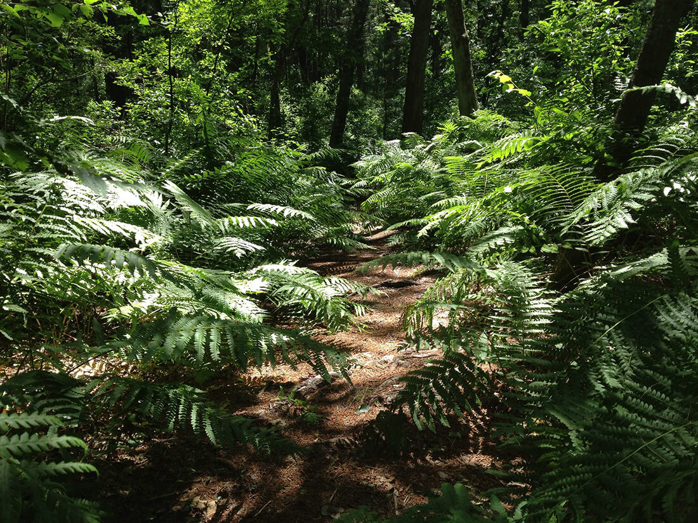
    </picture>
    <figcaption>Local fern gully, Great Meadows, Minnie Reed Conservation Area</figcaption>
</figure>

 
## Adlife Office, Warwick, RI

The web design studio was tucked into a strip mall and had a store front. Looking back, I understand how I came to adopt regular retreats to fresh air, plants, and dirt. While the endless pavement became too much, I did frequent some of the shops, like Boloco for their decent burritos.

There was a bike path on an old rail bed nearby that was just beautiful. It was often packed with like-minded pavement cynics.

<figure>
    <picture class="full">
        <source srcset="img/warwick/fences-and-golden-hour.webp" type="image/webp">
        <source srcset="img/warwick/fences-and-golden-hour.jpg" type="image/jpg">
        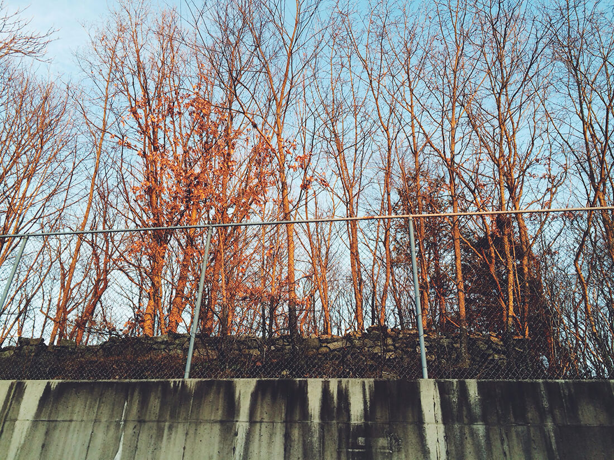
    </picture>
    <figcaption>Fall golden hour from a strip mall parking lot</figcaption>
</figure>
<figure>
    <picture class="full">
        <source srcset="img/warwick/rail-trail.webp" type="image/webp">
        <source srcset="img/warwick/rail-trail.jpg" type="image/jpg">
        
    </picture>
    <figcaption>Nearby rail trail</figcaption>
</figure>
<figure>
    <picture class="full">
        <source srcset="img/warwick/abandonded-post.webp" type="image/webp">
        <source srcset="img/warwick/abandonded-post.jpg" type="image/jpg">
        
    </picture>
    <figcaption>Evidence of posts used by a railroad</figcaption>
</figure>
<figure>
    <picture class="full">
        <source srcset="img/warwick/cement.webp" type="image/webp">
        <source srcset="img/warwick/cement.jpg" type="image/jpg">
        
    </picture>
    <figcaption>Leaf shadows on cement</figcaption>
</figure>
<figure>
    <picture class="full">
        <source srcset="img/warwick/yellows.webp" type="image/webp">
        <source srcset="img/warwick/yellows.jpg" type="image/jpg">
        
    </picture>
    <figcaption>Yellows</figcaption>
</figure>
<figure>
    <picture class="full">
        <source srcset="img/warwick/patriot-disposal.webp" type="image/webp">
        <source srcset="img/warwick/patriot-disposal.jpg" type="image/jpg">
        
    </picture>
    <figcaption>Patriot disposal</figcaption>
</figure>
<figure>
    <picture class="full">
        <source srcset="img/warwick/overgrown-wall.webp" type="image/webp">
        <source srcset="img/warwick/overgrown-wall.jpg" type="image/jpg">
        
    </picture>
    <figcaption>30-50 year old overgrown stone wall</figcaption>
</figure>
<figure>
    <picture class="full">
        <source srcset="img/warwick/breakroom.webp" type="image/webp">
        <source srcset="img/warwick/breakroom.jpg" type="image/jpg">
        
    </picture>
    <figcaption>Someone's break room</figcaption>
</figure>
<figure>
    <picture class="full">
        <source srcset="img/warwick/abandoned-barn.webp" type="image/webp">
        <source srcset="img/warwick/abandoned-barn.jpg" type="image/jpg">
        
    </picture>
    <figcaption>Shadows on barn</figcaption>
</figure>

## iMarket, Winooski, VT

When I joined the company, I brought with me my recharging ritual. The location was phenomenal for it. The office sat near the mouth of the Winooski river, downstream from the dam. I had a spot I would go that allowed me to explore and linger a few moments during lunch. The spot was no secret. There was evidence of drinkers and other lingerers, and further back still, ruins of woolen mills.

One winter day, my spot gave strong medicine in the form of a frozen coyote carcass. At the time, I was reading the work of Naturalist Tom Brown Jr. He uses the term medicine that follows Native American traditions, referring to a spiritual force rather than its conventional association with physical healing.

*“Medicine means the presence and power embodied in or demonstrated by a person, a place, an event, an object, or a natural phenomenon.”*

My initial awe, of brushing off the snow to the sight and presence, can still be conjured. I couldn’t get enough. Being with it felt magical and sacred. As winter passed into spring, one day the body was gone.

</figure>
    <picture class="full">
        <source srcset="img/winooski/winooski-frozen.webp" type="image/webp">
        <source srcset="img/winooski/winooski-frozen.jpg" type="image/jpg">
        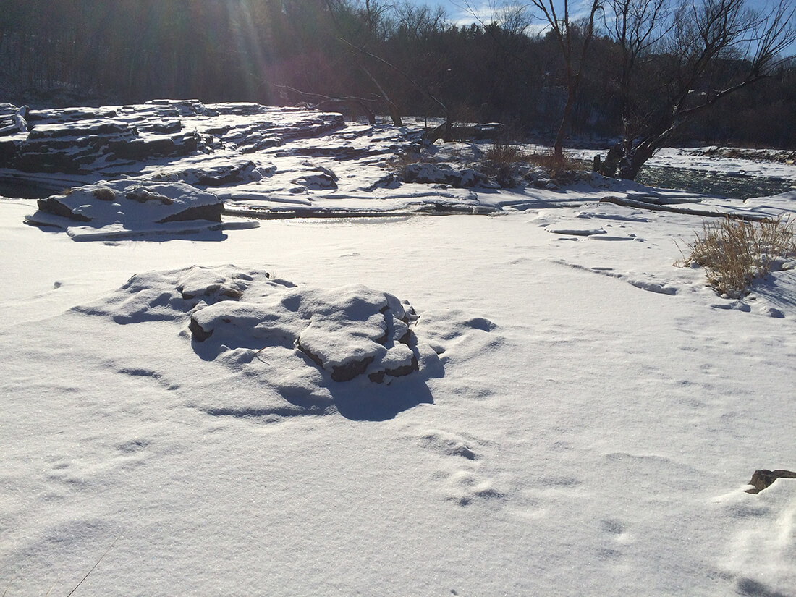
    </picture>
    <figcaption>Winooski river rocks in winter</figcaption>
<figure>

</figure>
    <picture class="full">
        <source srcset="img/winooski/winooski-bare.webp" type="image/webp">
        <source srcset="img/winooski/winooski-bare.jpg" type="image/jpg">
        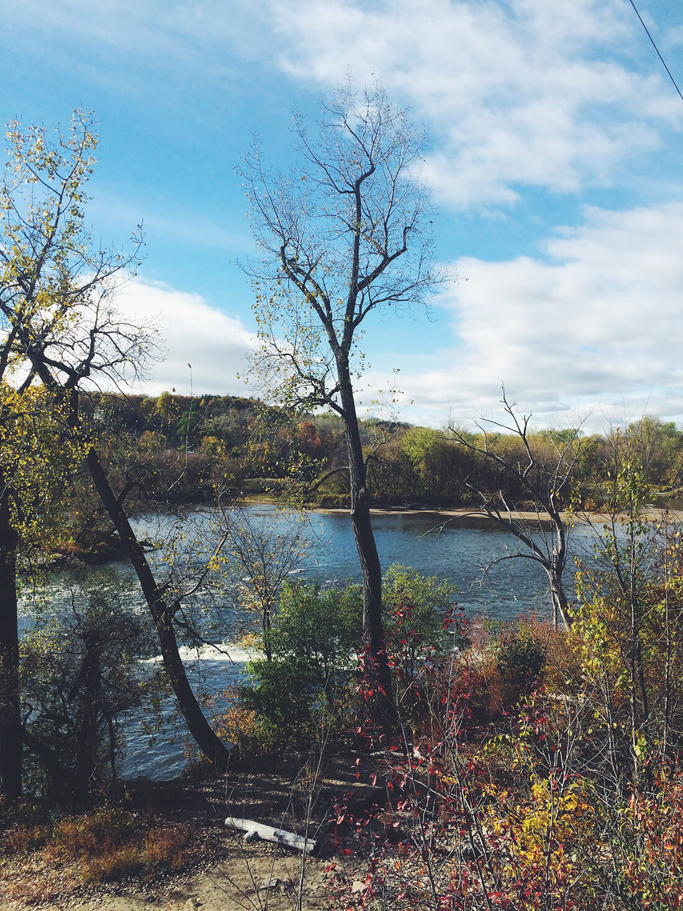
    </picture>
    <figcaption>Winooski river waking in spring</figcaption>
<figure>

</figure>
    <picture class="full">
        <source srcset="img/winooski/office-shadows.webp" type="image/webp">
        <source srcset="img/winooski/office-shadows.jpg" type="image/jpg">
        
    </picture>
    <figcaption>Office shadows from cedars</figcaption>
<figure>

</figure>
    <picture class="full">
        <source srcset="img/winooski/snow-lines.webp" type="image/webp">
        <source srcset="img/winooski/snow-lines.jpg" type="image/jpg">
        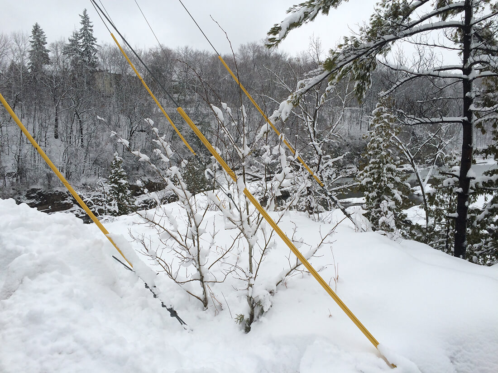
    </picture>
    <figcaption>Yellow on black & white</figcaption>
<figure>

</figure>
    <picture class="full">
        <source srcset="img/winooski/boat-steps.webp" type="image/webp">
        <source srcset="img/winooski/boat-steps.jpg" type="image/jpg">
        
    </picture>
    <figcaption>Boat stairs</figcaption>
<figure>

</figure>
    <picture class="full">
        <source srcset="img/winooski/grafitti-light.webp" type="image/webp">
        <source srcset="img/winooski/grafitti-light.jpg" type="image/jpg">
        
    </picture>
    <figcaption>Under the onramp</figcaption>
<figure>

</figure>
    <picture class="full">
        <source srcset="img/winooski/arborvitae.webp" type="image/webp">
        <source srcset="img/winooski/arborvitae.jpg" type="image/jpg">
        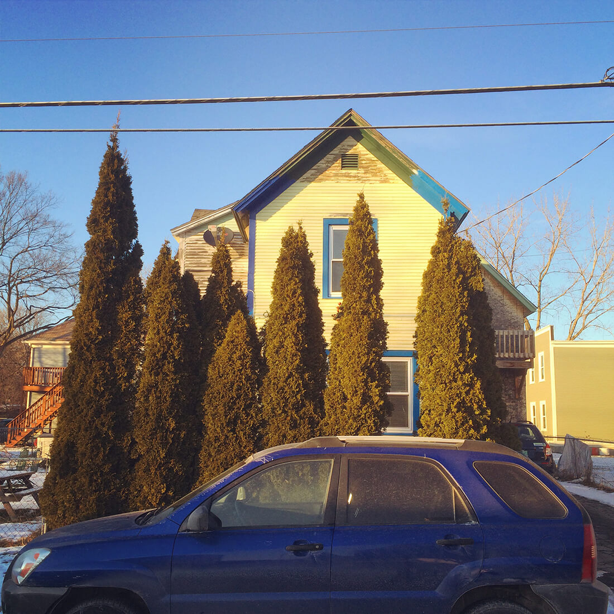
    </picture>
    <figcaption>Arborvitae privacy</figcaption>
</figure>

 
## iMarket, Colchester, Vermont

The company moved to the third floor of a business park. You wouldn’t think there would be much break from the pavement, but remember, this was Vermont. There was a loop in an adjacent business park other walkers would take. When the air and light were right, we’d be out there circling. There was also a path through a 200-yard corridor of woods that led to the back of a Shaws. This was air conditioning in the summer, a canvas for animal tracks in the winter, and a decent spot to watch birds.

The apps iNaturalist and Merlin Bird ID also did their part to pull me outside and prompt me to observe and identify.

</figure>
    <picture class="full">
        <source srcset="img/colchester/parking-lot-shapes.webp" type="image/webp">
        <source srcset="img/colchester/parking-lot-shapes.jpg" type="image/jpg">
        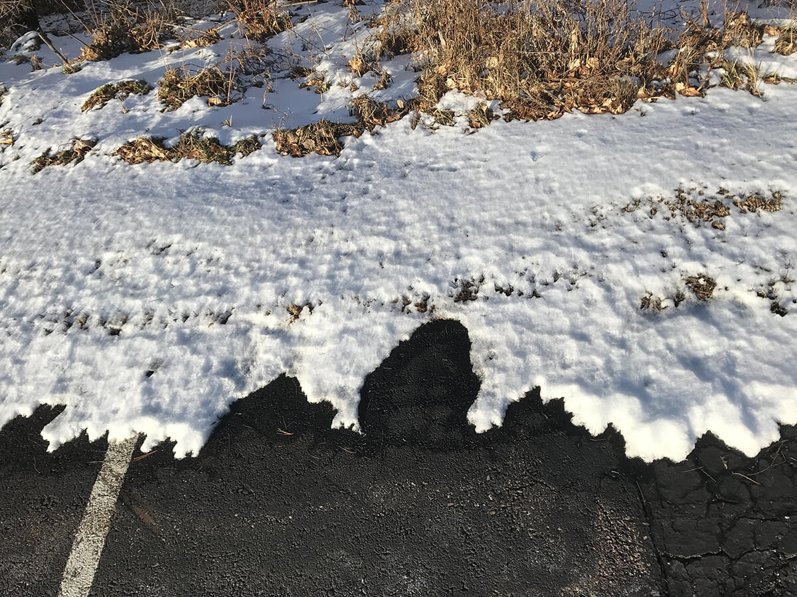
    </picture>
    <figcaption>Snow creeping</figcaption>
<figure>

</figure>
    <picture class="full">
        <source srcset="img/colchester/wolf-tree.webp" type="image/webp">
        <source srcset="img/colchester/wolf-tree.jpg" type="image/jpg">
        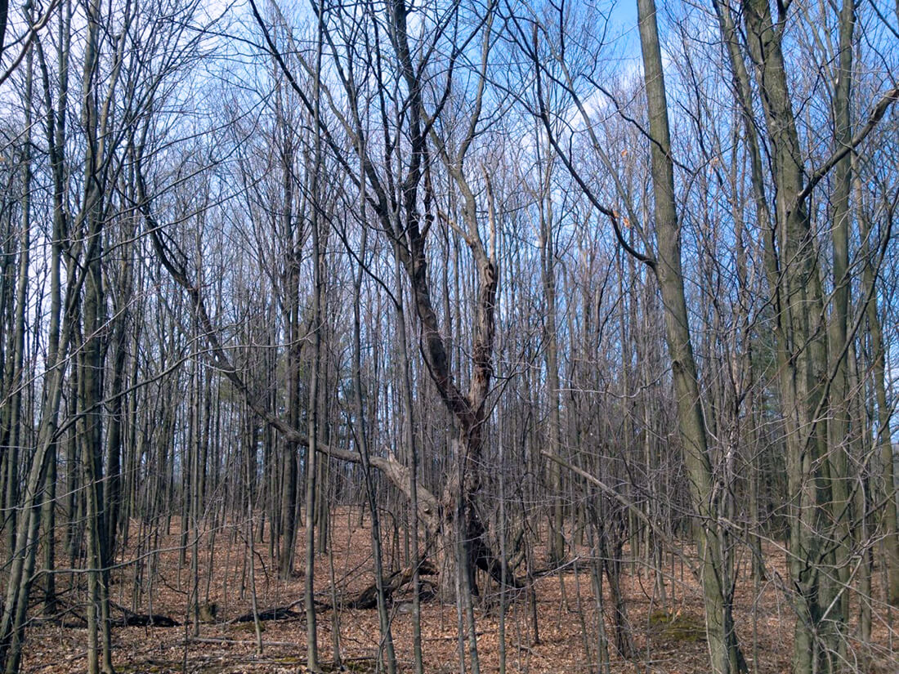
    </picture>
    <figcaption>A <a href="https://www.americanforests.org/article/wolf-trees-elders-of-the-eastern-forest/">wolf tree</a>, one of the first I spotted after learning the term </figcaption>
<figure>

</figure>
    <picture class="full">
        <source srcset="img/colchester/tree-on-hill.webp" type="image/webp">
        <source srcset="img/colchester/tree-on-hill.jpg" type="image/jpg">
        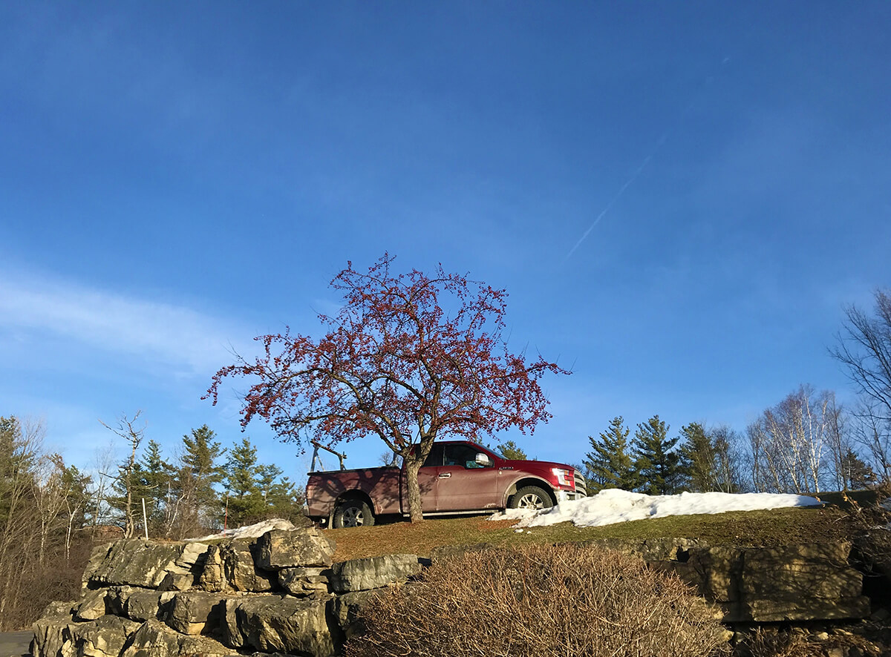
    </picture>
    <figcaption>Proud truck and matching tree</figcaption>
<figure>

</figure>
    <picture class="full">
        <source srcset="img/colchester/adk-crispy.webp" type="image/webp">
        <source srcset="img/colchester/adk-crispy.jpg" type="image/jpg">
        
    </picture>
    <figcaption>Adirondacks in winter</figcaption>
<figure>

</figure>
    <picture class="full">
        <source srcset="img/colchester/adk-orange.webp" type="image/webp">
        <source srcset="img/colchester/adk-orange.jpg" type="image/jpg">
        
    </picture>
    <figcaption>Adirondacks in fall</figcaption>
<figure>

</figure>
    <picture class="full">
        <source srcset="img/colchester/parking-lot-colors.webp" type="image/webp">
        <source srcset="img/colchester/parking-lot-colors.jpg" type="image/jpg">
        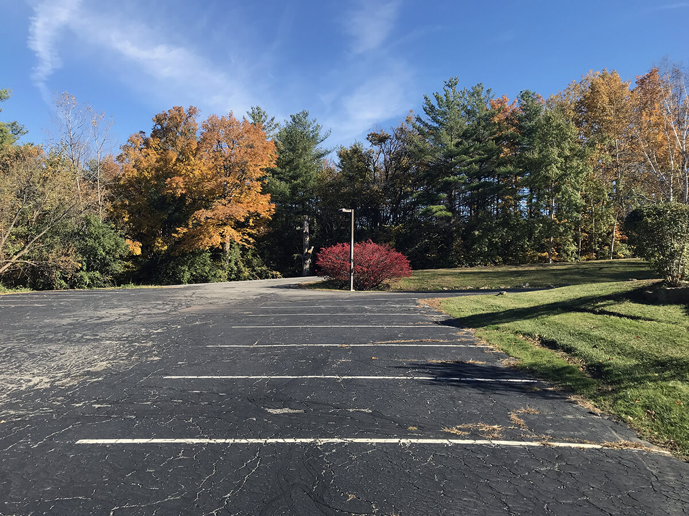
    </picture>
    <figcaption>The onset of autumn from the perspective of pavement</figcaption>
<figure>

</figure>
    <picture class="full">
        <source srcset="img/colchester/pooling-leaves.webp" type="image/webp">
        <source srcset="img/colchester/pooling-leaves.jpg" type="image/jpg">
        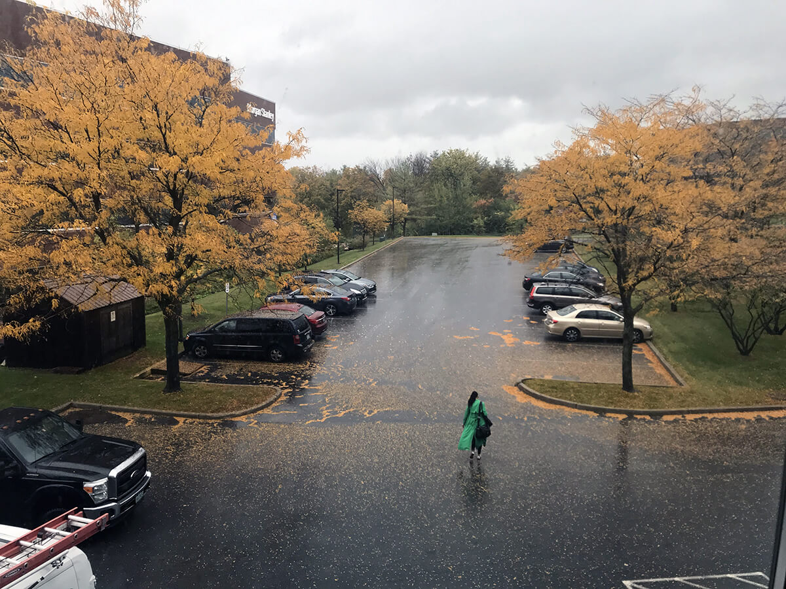
    </picture>
    <figcaption>Leaves pooling like metal filings</figcaption>
<figure>

</figure>
    <picture class="full">
        <source srcset="img/colchester/forest-air-conditioner.webp" type="image/webp">
        <source srcset="img/colchester/forest-air-conditioner.jpg" type="image/jpg">
        
    </picture>
    <figcaption> Forest air conditioner on hot summer walks</figcaption>
<figure>

</figure>
    <picture class="full">
        <source srcset="img/colchester/mansfield-in-winter.webp" type="image/webp">
        <source srcset="img/colchester/mansfield-in-winter.jpg" type="image/jpg">
        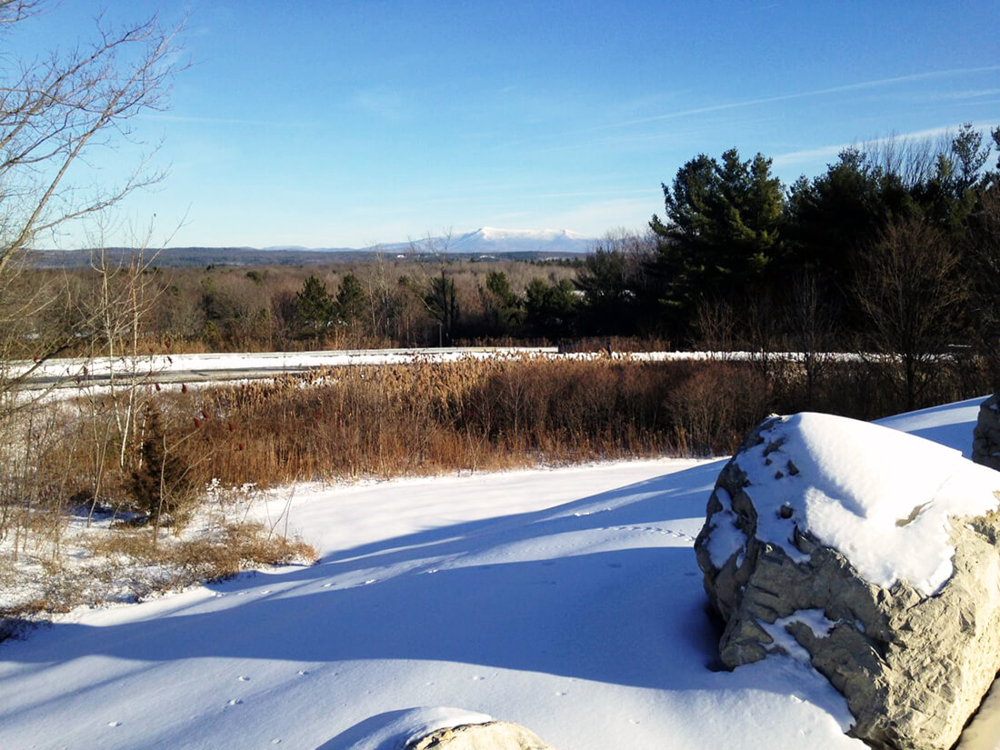
    </picture>
    <figcaption>Lunch walks had a great view</figcaption>
</figure>

</section>
