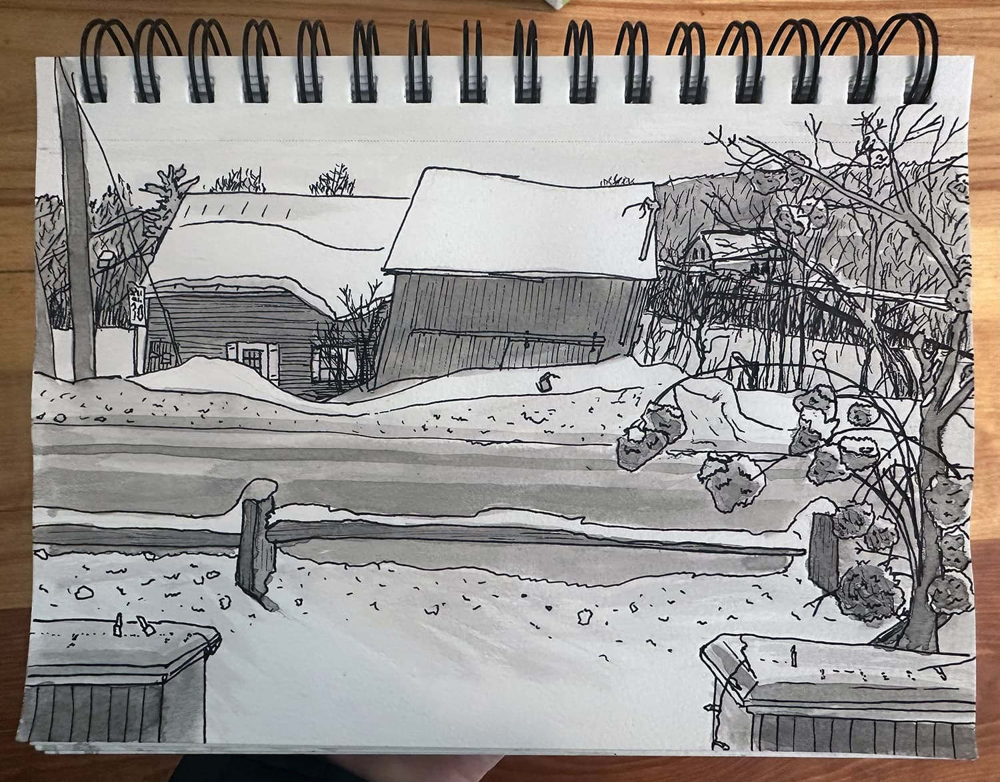

<section class="hero">
    <time class="meta-date" datetime="{{ date | postDate }}">Written: {{ date | postDate }}</time>

# {{title}}

</section>

<section>
    

        <figure>
            <picture class="full primary-image">
                <source srcset="img/snow-barn-2-6-25.webp" type="image/webp">
                <source srcset="img/snow-barn-2-6-25.jpg" type="image/jpg">
                
            </picture>
        </figure> 
  		
{{description}}

Our house is placed super close to the road, as is the set of mostly unused barns across the street. They just reroofed the tilted one so it might have more hope than it seems. 

I'm getting into a groove of creating these type of sketches. A new page layout is on the way...

	

</section>