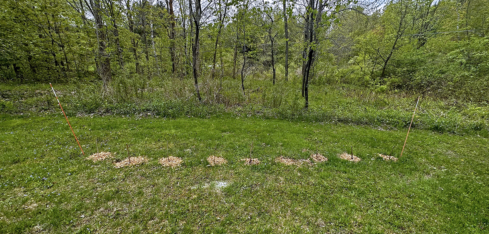
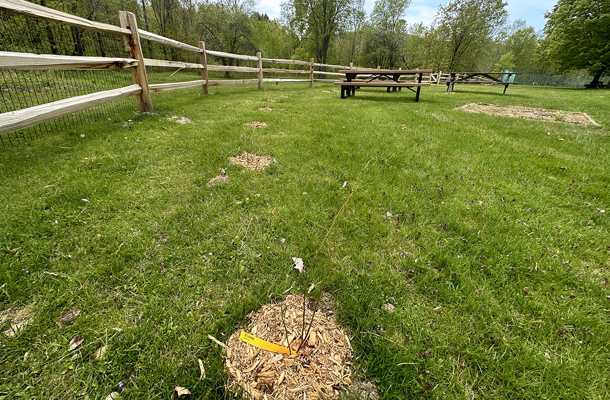
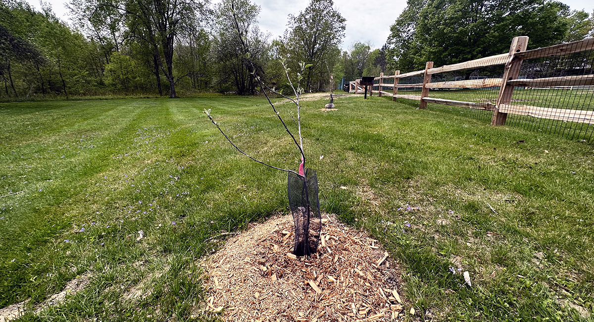

As of May 6th, 2023, there’s an orchard at the Underhill town pond.

Okay, calling it an orchard is a bit aspirational. There’s six apple trees, nine blueberries, and ten raspberries in the ground. Once they start producing, they’re up for grabs to anyone who comes by.

<figure>
	<a href="{{ page.url | url }}img/underhill-community-orchard-map-full.png">
		<picture>	 
			<source srcset="{{ page.url | url }}img/underhill-community-orchard-map.webp" type="image/webp">
			<source srcset="{{ page.url | url }}img/underhill-community-orchard-map.jpg" type="image/jpg">
			
		</picture>
		<figcaption>See full map with descriptions</figcaption>
	</a>
	</figure>

## It’s a public experiment of planting perennial fruit-givers on public land.

The trees and shrubs and fruit are visually unavoidable while folks are relaxing by the popular family swimming hole. My hope is the plants inspire conversation about why they were planted, local food insecurity, and how people can help. To continue imagining, it may even inspire folks to plant a their own which will boost the areas biodiversity. 

It’s also a physical connection point. Many locals in this town of Vermont are passionate about gardening and fruit trees, but much of that knowledge remains within the boundaries of property. I’m very much a part of the group that obsesses over my lawn and my 1 acre, but it’s knowledge-hoarding. Not dissimilar to every garage on the street stocking the same tools, same lawnmower, and same ladder. In our time and place of relative affluence, the potential for sharing is juicy ripe. The community orchard is tool sharing at the library. It’s the adorable used book houses that amass along roads. It may just coax those with nature-brains from their cozy nooks into the open.

These are my immediate visions for the project. A place to host knowledge-sharing workshops on:

- Pruning
- Composting
- Mulching
- Protecting growies from nibblers
- Grafting
- General maintenance 

A place to organize get-togethers:

- Pressing cider in the fall
- Food distribution 
- Blueberry picking to prepare for the yearly blueberry festival
- Jam-jamboree 
- Tree expert AMAs
- Fruit and nut tree certification program
- Personal yard/garden/orchard tours
- Wild neighborhood celebration with ferments made from the orchard!

So, the foundation is set. These activities just need a little nudge to get started.

This was what I brought to this project. I threw a humble nugget of initiative against the wall. I was, and still am, grateful that it stuck, that my pitch was accepted with open arms by two other fellow crew members. It as as if they were waiting, poised for a project like this.

## Here’s a summary of our process.
1. In late 2022, the town of requests community submissions for what to do with our ARPA money.
2. I take my new interest in fruit trees and resilience and penned a proposal.
3. Then I hesitate. I almost send it to the town, but instead send it to John who manages the food-sharing shed to get some notes. 
4. He loves the idea and pushes for usurping the funding and doing it ourselves, embodying Rob Hopkins from the [transition town movement](https://transitionnetwork.org/about-the-movement): 

	> “If we wait for governments, it will be too late. If we act as individuals, it will be too little. But if we act as communities, it might just be enough, and it might just be in time.”

5. We define the model of specialists and generalists: Each plant gets a specialist who’ll be the go-to resource and provide strategy when needed, but they won’t have to do all the work. General volunteers will provide support, like watering or weeding. 
6. We fill out the group with volunteers and friends.
7. We adjust the proposal to focus on approval not funding and send to the select board and recreation committee, because they manage the pond park.
8. In April, we get approval and some surprise funding support anyway. Plant orders are made. 
9. On May 6th, Earth Day and Vermont’s annual Green-Up Day, we welcome the plants into our ground.
10. Currently, we are in watering-mode. We assigned one of us to dump water from the pond onto each plant daily.

## The buzz from this project has me thinking, what’s next?
After being a part of a project like this, the idea bees are indeed abuzz. The notion of a public spud spot has already taken root. Empty patches in town are calling out to have fruit trees planted on them. The challenge at hand is tending to the wee saplings and shrubs that need extra care right now, but we’re in good hands. Apples won’t produce for 3-5 years. Blueberries will be sooner, and raspberries sooner still, but planting is just the beginning. Trees teach patience.

As I sought out similar projects while researching for this one, I noticed each project was at a different stage of maturity. The Underhill community orchard is indeed young and in the <em>establishment phase</em>. I found few that were in the <em>maturation</em> and <em>stewardship phase</em>, where the ecosystem is self-sufficient and requires minimum human input. This is the dream. Most I found were only a few years old. The projects that come up on google may not be an accurate view of the landscape and may indicate the people undertaking such projects aren’t tech-savvy and don’t update their blogs.

The projects do, however, share strikingly similar missions, like enhancing food security and access, promoting sustainability, ecological restoration, fostering community engagement, empowering folks to commune, etc. 

And even more radical missions like planning for the collapse of outdated systems by creating living examples of resilient and climate-adaptive agricultural systems that can withstand extreme weather conditions. Or intending to heal the severed wound of community and connection with the land.

I’m here for all of the above.

That’ll be in the next phase.

<figure>
	<picture>
	 	<source srcset="img/raspberries.webp" type="image/webp">
		<source srcset="img/raspberries.jpg" type="image/jpg">
		
	</picture>
	<figcaption>unimpressive raspberries</figcaption>
</figure>

<figure>
	<picture>
	 	<source srcset="img/blueberries.webp" type="image/webp">
		<source srcset="img/blueberries.jpg" type="image/jpg">
		
	</picture>
	<figcaption>blueberries inside the new fence</figcaption>
</figure>

<figure>
	<picture>
	 	<source srcset="img/apples.webp" type="image/webp">
		<source srcset="img/apples.jpg" type="image/jpg">
		
	</picture>
	<figcaption>apples outside the fence</figcaption>
</figure>

</section>
<section>

## Links on community orchards / food forests
General

- [Why orchard parks?](https://orchardpeople.com/orchard-parks): On the common objection of who will look after the trees? 
- [What are they?](https://orchardpeople.com/community-orchard-projects-that-inspire/): From Orchard People, a leading source on the subject.
- [Tree selection tool](https://vtcommunityforestry.org/tree-care/tree-selection-planting/tree-selection-tool): Filter by fruit, height, hardiness, and more. The Vermont Urban & Community Forestry Program site has handy resources on selling the benefits of trees and tips with governance. 

Vermont 

- [Strafford’s Edible Pocket Park](https://www.straffordvt.org/pocket-park): A park behind a rec field with over a hundred food-bearing plants, as well as, flowers, picnic tables, and benches by the river. 
- [Hartford, VT, Clifford Park Food Forest](http://foodforestcliffordpark.pbworks.com): Started in 2021. They have 3 plums in guilds, 10 nut trees, 5 pears, 3 peaches, 3 hawthorns, 8 hazelnuts, 9  and chestnuts, cover crops, Jerusalem artichokes, and sunflowers.
- [Branch out Burlington’s Tree Keeper program](https://branchoutburlington.org/get-involved/burlington-tree-keeper-program/): Model for maintenance that connects local folks to provide the tree simple care. "We are a group of volunteers who help plant and care for the trees of Burlington.”
- [ North Branch Nature Center in Montpelier](https://northbranchnaturecenter.org/orchard/): Started one in 2022, with 20 trees: apple, pear, plum, peach, and cherry, and have a compelling [adopt a tree](https://northbranchnaturecenter.app.neoncrm.com/forms/adopt-a-tree) method of support.
- [Montpelier has a Tree-Board](https://www.montpelier-vt.org/495/Tree-Board): They improve public health and preserves city beauty by enhancing and protecting street and park trees.
- [Randolph Community Orchard](https://www.randolphcommunityorchard.org/about/): Started in 2017 for a place for learning within a landscape of tree-based perennial food production. Their [fb](https://www.facebook.com/RandolphCommunityOrchard) has more photos.
- [Radicle Apple](https://www.radicleapple.org/the-orchard): a nonprofit apple orchard in southern VT that grows in partnership with the Vermont Foodbank, directly benefiting food-insecure Vermonters. In 2022 they gave about 15,000 pounds to food shelves.
- [Directory of 600+ community-based gardens](https://vtgardens.org/garden-directory/): The Vermont Garden Network has been working since 2001 to educate, support and connect gardeners. 

Northeast

- [Mt. Joy Orchard](https://mountjoyorchard.wixsite.com/mtjoy): A free-to-pick public orchard in Portland, Maine. Featuring over 100 diverse fruit trees, including Paw Paws, Apricots, Asian Pears, Elder Berries, and Plums.
- [Boston Food Forest Coalition](https://www.bostonfoodforest.org/locations): a network of neighborhood-based, publicly accessible food gardens throughout Boston. 9 so far since 2014! 
- [The Open Orchard](https://www.govisland.com/things-to-do/public-art/the-open-orchard): new in 2022 to Gov­er­nors Island, NYC that was commissioned by an artist. A public orchard of 100+ heirloom fruit varieties trees all indige­nous to the area within the last 400 years. Love the name. 
  
  
</section>