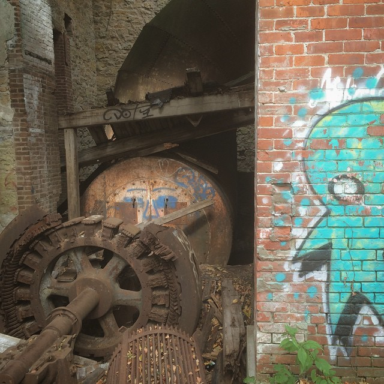
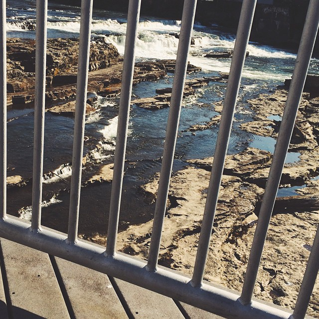

<!-- date: 2019-05-01 -->

<h1>Lunch-Break Sacred Places</h1>

<!-- Excerpt Start -->
A journal photo collection. Each job since college, I've wound up finding a nearby place that became a home-base of sorts. My lunch break was a break from people and screens. Now, I didn't set out to 'get closer to nature' or 'forest bathe' - it was something my mind and body needed in the moment and I abided.
<!-- Excerpt End -->

<h2>Typically I consider myself terrible at maintaining new habits.</h2>
This one stuck though because the need was deep I think. Repetition in a routine like this deepens your awareness of a place. The place becomes a character in the story and a relationship between the two of you begins. You pick up new observations with each visit and a mental replica gets constructed in the psyche, with a layer of detail added on each visit. Nothing about the stacking of detail layers is linear. Words like depth start to peek into the complexity of considering a place to have being-like characteristics.

When I was thinking about writing this post, previous sacred places from my past bubbled up as landmarks in my timeline. Countless treeforts, the weird attic that had a tiny door off my bedroom… Most of them were outside. Maybe that’s because inside is too populated. Too busy. Too disconnected. You create little worlds best with a few buds, some solitude, and definitely time.

Below is a snapshot into my sacred lunch-break places with photos I’ve summoned from the depths of the cloud.

## Brady People ID, Burlington, MA
Newbury Comics / Wendy’s

Ok. This job stint didn’t have a non human-made element to it, but it did offer separation from the screen.

I cherish browsing record stores. I didn’t buy things often but meandering was darn fulfilling and I’d always leave feeling like it’d charged the batteries. This was the dawn of podcasting. I’d often listen while scarfing down dollar menu items. In hindsight, aside from my amazement thanks to shows like Radiolab, the memory of sitting in a parking lot eating cheap food listening to the radio brings up more regret than fulfillment.
Brady People ID, Billerica, MA

The office moved and my breaks were spent outside exploring. I don’t remember having one specific spot, but I got that hip new Instagram app and an even hipper panorama app to thank for inspiring photo taking.

 
## Adlife Office, Warwick, RI

The office was tucked into a gross strip mall. Looking back, I understand how I came to adopt regular retreats to fresh air, plants, and dirt. The endless pavement became too much. I did became fond of Boloco though.

There was a bike path on an old rail bed nearby that was just beautiful. Sometimes it was quite packed by like-minded pavement haters.

## iMarket, Winooski, VT

When I joined the company, I brought with me my recharging ritual. The location was phenomenal. It sat right next to the mouth of the Winooski river, downstream from the dam. I had a spot I would go that allowed me to explore and linger a few moments during lunch. The spot was no secret. There was evidence of drinkers and other lingerers. And longer still, ruins of woolen mills.

One winter day, my spot gave strong medicine in the form of a frozen coyote carcass. At the time, I was reading Naturalist Tom Brown Jr. who uses the term medicine as Native Americans do. “Medicine means the presence and power embodied in or demonstrated by a person, a place, an event, an object, or a natural phenomenon.” My initial awe, of brushing off the snow to the sight and presence, can still be conjured. I couldn’t get enough. Being with it felt magical and sacred. As winter passed into spring, one day the body was gone.

 
## iMarket, Colchester, Vermont

The company moved to the third floor of the business park. You wouldn’t think there would be much break from the pavement, but this was Vermont remember. There was a loop in an adjacent business park other walkers would take. When the air and light were right, we’d be out there circling. There was also a path through a 200 yard corridor of words to lead to the back of a Shaws. This was air conditioning in the summer, a canvas for animal tracks in the winter, and a decent spot to watch birds. This spot reminds me of more apps: iNaturalist and Merlin Bird ID. They pulled me outside and prompted me observe and identify.